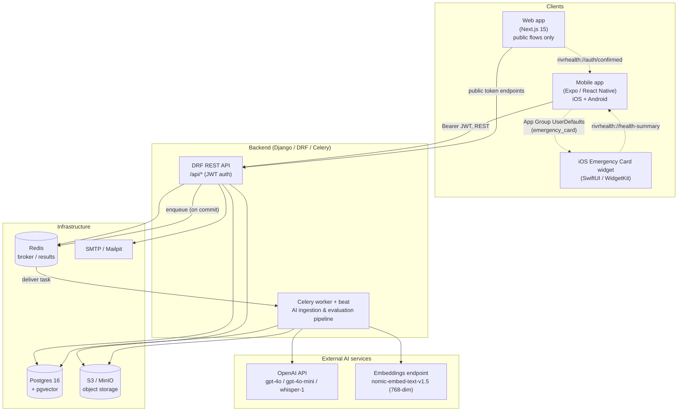
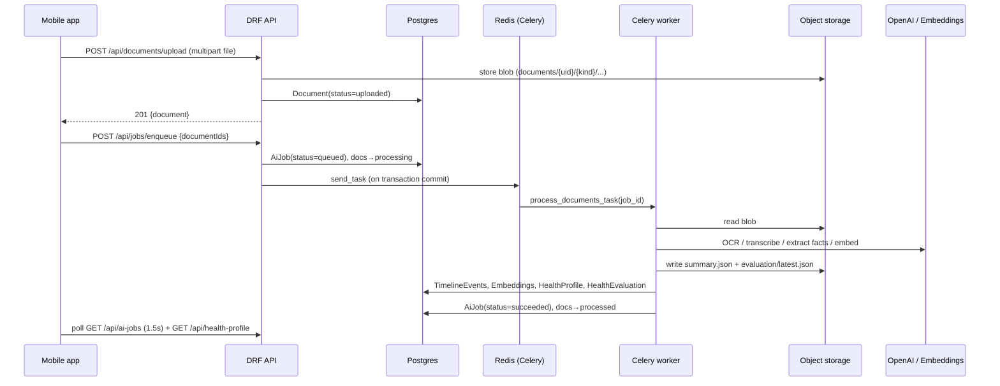

# RIVR Health AI — Documentation Index & System Overview

> The entry point for engineers new to the RIVR Health AI monorepo. Read this first. It explains **what** the product is, **what the three clients are**, **how they fit together**, the **full technology stack**, the **repository layout**, and **where to go next** in the rest of this documentation set.

---

## 1. What is RIVR Health AI?

RIVR Health AI is a **personal health-document management + AI application**. A user uploads their medical records (PDFs, scanned images, photos, voice notes) and links Apple Health; the backend **ingests** those documents with an AI pipeline (OCR, transcription, LLM fact extraction, embeddings), **evaluates** the user's overall health into a score + structured summary + a "3×5" emergency card, and serves that back to the clients. The user can then browse a unified **timeline**, ask **AI Q&A** questions over their own records (RAG), generate **time-limited share links** of health PDFs for a clinician, and surface critical info on an **iOS home-screen Emergency Card widget**.

The system is built around three independently-deployed clients plus one native widget, all talking to a single Django backend over a JWT-authenticated REST API:

| Client | Tech | Role |
|---|---|---|
| **Mobile app** | Expo / React Native (iOS + Android) | The primary product. Upload/scan documents, record voice notes, view SHIN score & AI summary, timeline, AI Q&A, share links, Apple Health (HealthKit) integration, profile/onboarding. |
| **Web app** | Next.js 15 (App Router) | A tiny, **unauthenticated** companion. Hosts the three flows reached from external browsers / email links: password reset, email verification, and the **public share viewer**. |
| **Backend** | Django 5.1 / DRF / Celery | The single source of truth. Auth, storage, the AI ingestion + evaluation pipeline, RAG Q&A, timeline, shares, and all REST APIs. |
| **iOS widget** | SwiftUI / WidgetKit (`targets/widget/`) | A home-screen "Emergency Card" widget that reads data the mobile app writes into a shared **App Group** and deep-links back into the app. |

> **Naming note:** the user-facing health score is referred to as the **SHIN Score** in the mobile UI (route `ShinScore`), and as `score` / `score_0_to_100` in the backend data model.

---

## 2. How it all fits together (component diagram)



**The seams that connect the pieces** (worth internalizing early):

- **REST + JWT** is the only path between the mobile/web clients and the backend. Base URL on mobile is `EXPO_PUBLIC_API_URL`; on web it's `NEXT_PUBLIC_API_URL`. See `src/lib/api/client.ts` and `web/lib/api.ts`.
- **Object storage** (S3/MinIO) holds the raw uploads, per-document fact summaries, evaluation JSON, avatars, and share PDFs — under a single bucket keyed by `documents/{user_id}/...`, `avatars/...`, `share-artifacts/...`. Clients receive **short-lived signed URLs**, never direct storage access.
- **Redis** is the Celery broker (DB 0) and result backend (DB 1). The API enqueues jobs; the worker runs the pipeline.
- The deep-link scheme **`rivrhealth://`** is the seam from web → app (`rivrhealth://auth/confirmed`) and widget → app (`rivrhealth://health-summary`).
- The iOS **App Group** `group.com.rivrhealth.app` (UserDefaults key `emergency_card`) is the seam from the mobile app → the iOS widget. Both sides hardcode these identical constants.

---

## 3. The end-to-end happy path (document → score)

A new engineer should understand this one flow before anything else. **Upload does not process** — enqueue is a separate, explicit call.



The full mechanics (per-document extraction, OCR-quality heuristics, unit normalization, facts digest caching, the shared evaluation tail, RAG Q&A) live in **[AI Document Ingestion Pipeline & RAG Q&A](ai-ingestion-and-qa.md)**. The job orchestration, enqueue dedupe, and stale-job recovery live in **[Backend Services](backend-services.md)**.

---

## 4. Documentation table of contents

This is the full RIVR Health AI documentation set. Start here, then follow the links by topic.

| # | Document | What it covers |
|---|---|---|
| — | **[RIVR Health AI — Documentation Index & System Overview](README.md)** *(this file)* | The landing page: product overview, the three clients + widget, the component diagram, the full stack, repo layout, and this index. |
| 1 | **[Architecture Overview](architecture-overview.md)** | The system in depth: process topology, request/data flow across all components, the auth model, async job model, storage layout, and cross-cutting concerns (security gotchas, the no-prod-settings issue, signed-URL caveat). |
| 2 | **[Backend Services (Django / DRF / Celery)](backend-services.md)** | Every Django app (`accounts`, `profiles`, `documents`, `timeline`, `health`, `jobs`, `shares`, `common`), models/fields, the complete REST endpoint inventory, DRF/JWT config, the Celery job lifecycle, enqueue/dedupe/recovery, and shares security. |
| 3 | **[AI Document Ingestion Pipeline & RAG Q&A](ai-ingestion-and-qa.md)** | The Celery pipeline internals: PDF/text extraction (PyMuPDF), OCR/transcription, LLM fact extraction (OpenAI Responses API + pydantic schemas), embeddings + pgvector index, the health-evaluation tail, AI backfill, and the RAG Q&A retrieval flow. |
| 4 | **[Mobile App (Expo / React Native)](mobile-app.md)** | The mobile client: provider tree, three-stack navigation, session/theme/network/Apple-Health contexts, the API layer, every screen, document scan/upload, voice notes, job-status polling UI, Apple HealthKit integration, and the Emergency Card widget bridge. |
| 5 | **[Web App (Next.js)](web-app.md)** | The Next.js companion: the `(auth)` route group, reset-password / verify-email / public share-viewer pages, the tiny fetch wrapper, Tailwind config, and the deep-link handoff back into the mobile app. |
| 6 | **[Data Model & End-to-End Flows](data-model-and-flows.md)** | The cross-app data model (User, UserProfile, Document, TimelineEvent, AiJob/AiJobEvent, Embedding, HealthProfile, HealthEvaluation, SharePackage), their relationships, and the full end-to-end flows (signup, upload→process, evaluation, Q&A, sharing, account deletion). |
| 7 | **[Build, Deploy & Infrastructure](build-deploy-infra.md)** | docker-compose stack, the `./dev` launcher, the Dockerfile, settings split, env-var reference, EAS build/submit profiles, the iOS/Android native config, the fmt config plugin, and the Apple widget target build. |
| 8 | **[Technology Stack Reference](tech-stack.md)** | A consolidated, versioned reference of every dependency and external service across backend, mobile, and web. |

---

## 5. Technology stack at a glance

A complete stack reference (with exact versions) lives in **[Technology Stack Reference](tech-stack.md)**. The summary below is enough to orient yourself. Versions are taken from `backend/requirements.txt`, `package.json`, and `web/package.json`.

### 5.1 Backend (`backend/`)

| Layer | Technology | Version constraint |
|---|---|---|
| Language / runtime | Python | 3.12 (`python:3.12-slim` image) |
| Web framework | Django | `>=5.1,<5.2` |
| API framework | Django REST Framework | `>=3.15,<3.16` |
| Auth | `djangorestframework-simplejwt` (+ `token_blacklist`) | `>=5.3,<6` |
| Config | `django-environ` | `>=0.11,<0.12` |
| DB driver | `psycopg[binary]` | `>=3.2,<4` |
| Async tasks | Celery (+ beat) | `>=5.4,<6` |
| Broker / results | `redis` | `>=5.2,<6` |
| Object storage | `django-storages` + `boto3` | `>=1.14,<2` / `>=1.35,<2` |
| CORS | `django-cors-headers` | `>=4.6,<5` |
| Filtering | `django-filter` | `>=24.3` |
| API schema/docs | `drf-spectacular` | `>=0.28,<0.29` |
| Images | `Pillow` | `>=11,<12` |
| WSGI server | `gunicorn` | `>=23,<24` |
| Static files | `whitenoise` | `>=6.8,<7` |
| Structured output | `pydantic` | `>=2.9,<3` |
| AI SDK | `openai` | `>=1.50,<2` |
| Vector search | `pgvector` | `>=0.3,<0.4` |
| PDF parsing | `PyMuPDF` (`fitz`) | `>=1.24,<2` |
| PDF generation | `reportlab` | `>=4,<5` |

### 5.2 Mobile (`/` root — Expo)

| Layer | Technology | Version |
|---|---|---|
| Framework | Expo SDK | `~54.0.34` |
| Runtime | React Native | `0.81.5` (New Architecture **disabled**) |
| UI | React | `19.1.0` |
| Navigation | `@react-navigation/native` + `native-stack` | `^7.1.26` / `^7.9.0` |
| Storage | `@react-native-async-storage/async-storage` | `2.2.0` |
| HealthKit | `react-native-health` | `^1.19.0` |
| Widget targets | `@bacons/apple-targets` | `4.0.7` |
| Error monitoring | `@sentry/react-native` | `~7.2.0` |
| QR codes | `react-native-qrcode-svg` | `^6.3.21` |
| PDF (web scan path) | `@cantoo/pdf-lib` | `^2.6.1` |
| Native scan path | `expo-print`, `expo-image-manipulator`, `expo-document-picker`, `expo-image-picker` | per SDK 54 |
| Tests | `vitest` | `^4.1.6` |

### 5.3 Web (`web/` — Next.js)

| Layer | Technology | Version |
|---|---|---|
| Framework | Next.js (App Router) | `^15.5.19` |
| UI | React / React DOM | `19.0.0` |
| Styling | Tailwind CSS + PostCSS + autoprefixer | `3.4.17` / `8.5.1` / `10.4.20` |
| Language | TypeScript | `5.7.3` |

### 5.4 Infrastructure & external services

| Service | Image / endpoint | Notes |
|---|---|---|
| Postgres + pgvector | `pgvector/pgvector:pg16` | Postgres 16; required for `ArrayField` + vector search. Host port `5433:5432`. |
| Redis | `redis:7` | Celery broker (DB 0) + result backend (DB 1). |
| MinIO (S3) | `minio/minio` | Object storage; API `:9000`, console `:9001`. Single bucket `rivr-media`. |
| Mailpit | `axllent/mailpit` | Local SMTP catcher; SMTP `:1025`, UI `:8025`. |
| OpenAI | `https://api.openai.com/v1` | `gpt-4o-2024-08-06` (extract/eval), `gpt-4o-mini` (OCR), `whisper-1` (transcribe). |
| Embeddings | `EMBEDDING_BASE_URL` (defaults to OpenAI) | `nomic-embed-text-v1.5`, 768-dim, OpenAI-compatible shape. |
| Sentry | `EXPO_PUBLIC_SENTRY_DSN` | Mobile error monitoring (disabled in `__DEV__`). |
| EAS / Vercel | Expo Application Services / Vercel | Mobile builds (EAS project `0b17b39a-c1e6-49f9-95e3-71acea501e8f`); web hosting. |

### 5.5 AI model configuration (defaults, `backend/config/settings/base.py:182-199`)

| Setting | Default | Used for |
|---|---|---|
| `AI_MODEL_EXTRACT` | `gpt-4o-2024-08-06` | Per-document fact extraction (Responses API + pydantic). |
| `AI_MODEL_EVAL` | `gpt-4o-2024-08-06` | Health evaluation; also the Q&A fallback model. |
| `AI_MODEL_OCR` | `gpt-4o-mini` | Vision OCR of document images / rendered pages. |
| `AI_MODEL_TRANSCRIBE` | `whisper-1` | Voice-note audio transcription. |
| `AI_MODEL_QUESTION_ANSWER` | `""` (empty) | RAG Q&A; **empty → falls back to `AI_MODEL_EVAL`**. |
| `EMBEDDING_MODEL` | `nomic-embed-text-v1.5` | Doc-chunk / fact embeddings for the pgvector index. |
| `EMBEDDING_DIM` | `768` | Must match `Embedding.vector = VectorField(dimensions=768)`. |

---

## 6. Repository top-level layout

The repo is a **monorepo** with the Expo mobile app at the root, the backend under `backend/`, the web app under `web/`, and the iOS native + widget projects in `ios/`, `android/`, and `targets/`.

```
RIVR-Health-AI/
├── App.tsx                  # Mobile root: Sentry.wrap(App), ThemeProvider → SessionProvider → AppInner
├── index.ts                 # registerRootComponent(App)
├── app.json                 # Expo config (scheme rivrhealth, bundle com.rivrhealth.app, plugins, entitlements)
├── eas.json                 # EAS build/submit profiles (dev/preview/production)
├── package.json             # Expo/React Native dependency tree (separate from web/)
├── dev                      # Executable ./dev launcher (spins up backend + web + mobile)
│
├── src/                     # Mobile app source
│   ├── navigation/          # AppNavigator / AuthNavigator / OnboardingNavigator, linking.ts, navRef
│   ├── context/             # SessionContext, ThemeContext, NetworkContext, AppleHealthContext, OnboardingContext
│   ├── lib/                 # api/ (client, auth, data), health/ (HealthKit), emergencyCardWidget/, recommendations, etc.
│   ├── screens/             # Auth/, App/ (Home, ManageDocuments, HealthSummary, Timeline, Share, ...), Onboarding
│   ├── components/          # UI components (ManageDocuments upload/scan, Widget AddWidgetCard, ...)
│   └── theme/               # tokens.ts, createStyles.ts (design system)
│
├── backend/                 # Django / DRF / Celery backend
│   ├── config/              # Project package: settings/ (base, dev, test), urls.py, wsgi/asgi, celery.py
│   ├── apps/                # accounts, profiles, documents, timeline, health, jobs, shares, common
│   ├── tests/               # pytest suite (real Postgres, eager Celery, in-memory storage)
│   ├── docker-compose.yml   # db / redis / minio / mailpit / web / worker / beat
│   ├── docker-compose.local.yml  # gitignored coexistence override (:8001)
│   ├── Dockerfile           # python:3.12-slim + gunicorn
│   ├── requirements.txt     # runtime deps
│   └── manage.py
│
├── web/                     # Next.js 15 companion (separate dependency tree)
│   ├── app/                 # App Router: page.tsx, (auth)/reset-password, (auth)/verify-email, share/
│   ├── components/ui.tsx    # Shared primitives (Logo, Button, Input, Card, CtaLink)
│   ├── lib/api.ts           # Tiny fetch wrapper (NEXT_PUBLIC_API_URL)
│   └── tailwind.config.ts
│
├── ios/                     # Generated iOS native project (entitlements, Info.plist, Podfile + fmt patch)
├── android/                 # Generated Android native project (manifests, build.gradle)
├── targets/widget/          # SwiftUI Emergency Card widget (WidgetKit, App Group bridge)
├── plugins/                 # with-ios-fmt-xcode-fix.js (Expo config plugin)
├── scripts/                 # Dev/fixture helpers (build-health-summary, empty-share-artifacts)
└── assets/branding/         # App icons, splash, logos
```

> **Two separate dependency trees:** the root `package.json` (Expo/React Native) and `web/package.json` (Next.js) are independent — each has its own `node_modules` and lockfile. The `./dev` launcher installs each separately. See **[Build, Deploy & Infrastructure](build-deploy-infra.md)**.

---

## 7. The REST API surface (at a glance)

Every client talks to the backend over `/api/*`. The full inventory with request/response shapes is in **[Backend Services](backend-services.md)**; this is a map of where things live (mounted in `backend/config/urls.py`).

| Prefix | App | Examples |
|---|---|---|
| `/api/auth/` | `accounts` | `register`, `login`, `token/refresh`, `logout`, `me`, `verify-email`, `password/forgot`, `password/reset`, `password/change` |
| `/api/account` | `accounts` | `DELETE` — delete current user + their storage objects |
| `/api/profile`, `/api/profile/avatar`, `/api/profile/link-health` | `profiles` | Read/update own profile, avatar upload, Apple-Health link flags |
| `/api/documents/`, `/api/documents/upload/`, `/api/documents/{id}/file/` | `documents` | Document CRUD + multipart upload + signed file URL |
| `/api/timeline-events/` | `timeline` | Full CRUD + bulk create (Apple-Health array sync) |
| `/api/health-profile`, `/api/health-evaluations/`, `/api/qa` | `health` | Latest score/summary/card, evaluation log, **RAG Q&A** |
| `/api/jobs/enqueue`, `/api/ai-jobs/`, `/api/ai-jobs/{id}/cancel/` | `jobs` | Enqueue processing/evaluation, poll job status, cooperative cancel |
| `/api/shares`, `/api/shares/resolve` | `shares` | Create a time/view-limited share link; **public** resolve (token + optional PIN) |
| `/api/schema/`, `/api/docs/`, `/healthz` | `config` | OpenAPI schema (drf-spectacular), Swagger UI, health check |

**Cross-cutting API facts:**
- Auth is JWT (`Authorization: Bearer <access>`); access tokens last 30 min, refresh tokens 30 days with rotation + blacklist-after-rotation. Default DRF permission is `IsAuthenticated` (opt-in `AllowAny` per view).
- Owner-scoped viewsets (`OwnedModelViewSet`) filter by the requesting user, so other users' rows return **404, not 403** (no existence leak).
- **Trailing-slash convention is inconsistent**: auth/profile endpoints have **no** trailing slash; documents/jobs/timeline endpoints **do**. Clients must match DRF's `APPEND_SLASH` behavior. (See `src/lib/api/data.ts`.)

---

## 8. Important things to know before you dig in

These are the highest-value gotchas. Each is expanded in the linked doc.

1. **There is no `config.settings.prod` module.** `wsgi`/`asgi`/`celery` and gunicorn all default to `config.settings.dev` (which sets `DEBUG=True` and `CORS_ALLOW_ALL_ORIGINS` defaults to `True`) unless `DJANGO_SETTINGS_MODULE` is overridden in the environment. → [Build, Deploy & Infrastructure](build-deploy-infra.md)
2. **Upload ≠ processing.** `POST /api/documents/upload/` only creates an `uploaded` Document; the client must separately `POST /api/jobs/enqueue` to start the pipeline. No Django signals connect the two. → [Backend Services](backend-services.md)
3. **Signed storage URLs use the internal MinIO endpoint** (`http://minio:9000`) with no custom-domain override, so signed URLs are not reachable from a device/host in local dev. → [Architecture Overview](architecture-overview.md)
4. **Secrets are committed** in `backend/.env` (a real-looking `OPENAI_API_KEY`) and `.env.local` (a Vercel OIDC token). Treat as a finding, not a pattern to follow. → [Build, Deploy & Infrastructure](build-deploy-infra.md)
5. **The iOS widget contract is hardcoded on both sides** — App Group `group.com.rivrhealth.app` + UserDefaults key `emergency_card` appear in both `src/lib/emergencyCardWidget/sync.ts` and `targets/widget/EmergencyCardWidget.swift`. Changing one without the other silently breaks the widget. → [Mobile App](mobile-app.md)
6. **No realtime anywhere** — every "live" mobile surface polls (docs every 4s, jobs every 1.5s, health summary every 4s). Comments referencing "Supabase realtime" are leftovers from the pre-Django migration. → [Mobile App](mobile-app.md)
7. **`EMBEDDING_DIM` (768) is decoupled** from the hardcoded `768` in `backend/apps/jobs/embeddings.py` and the `VectorField(dimensions=768)` DB column — changing the env var alone will not migrate the database. → [AI Document Ingestion Pipeline & RAG Q&A](ai-ingestion-and-qa.md)

---

*This document is the index. For anything deeper, follow the links in [§4](#4-documentation-table-of-contents).*
