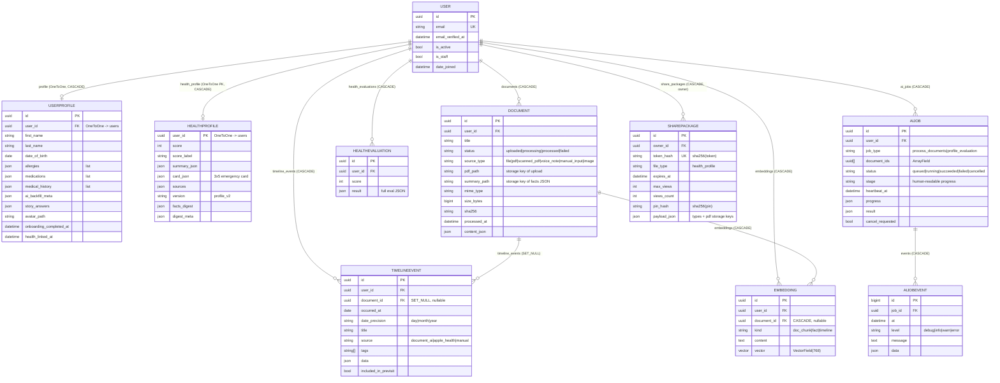
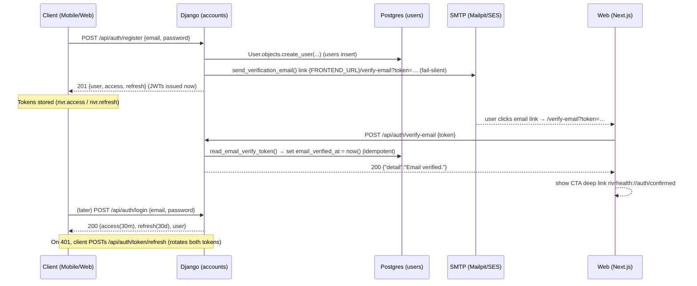
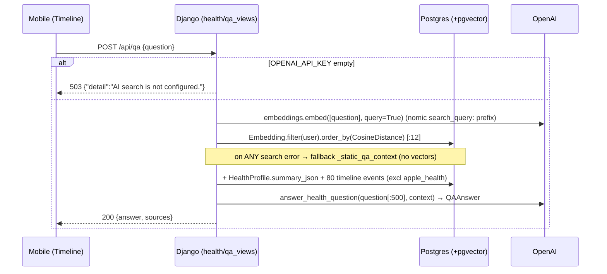
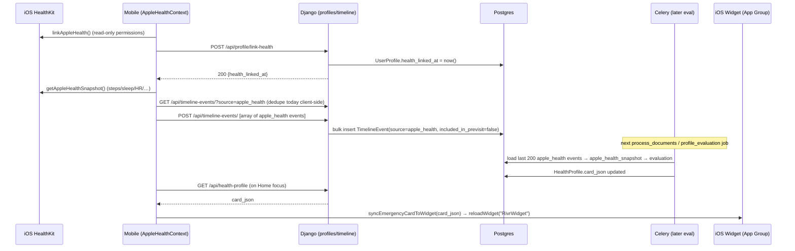

# Data Model & End-to-End Flows

This document is the consolidated **data-model reference** for the RIVR Health AI backend (an ER-style overview of every Django model and its relationships) plus the **key end-to-end flows** traced across all tiers — mobile/web client → Django/DRF → Celery worker → OpenAI/embeddings → object storage → back to the client.

For deeper, per-area detail, link out rather than duplicate:

- System overview & index: [README.md](./README.md)
- High-level component architecture: [architecture-overview.md](./architecture-overview.md)
- Django/DRF/Celery service internals (viewsets, permissions, settings): [backend-services.md](./backend-services.md)
- AI pipeline & RAG internals (prompts, OpenAI calls, chunking): [ai-ingestion-and-qa.md](./ai-ingestion-and-qa.md)
- Mobile client (Expo/React Native): [mobile-app.md](./mobile-app.md)
- Web client (Next.js): [web-app.md](./web-app.md)
- Build, deploy & infra (Docker, MinIO, EAS): [build-deploy-infra.md](./build-deploy-infra.md)
- Library/version reference: [tech-stack.md](./tech-stack.md)

> Convention notes used throughout:
> - All PKs are **UUIDv4** unless stated otherwise (via `apps/common/models.py` `UUIDModel`).
> - `created_at` / `updated_at` timestamps come from `TimeStampedModel`; `BaseModel = UUIDModel + TimeStampedModel`.
> - DRF default auth is JWT (`rest_framework_simplejwt`), default permission `IsAuthenticated`; all owner-scoped viewsets 404 (not 403) on cross-user access.
> - Trailing-slash convention is **inconsistent**: auth/profile/health/jobs-enqueue/shares singleton paths have **no** trailing slash; DRF router resources (`documents`, `timeline-events`, `ai-jobs`, `health-evaluations`) **do** (e.g. `/api/documents/`).

---

## 1. Data-Model Reference (ER overview)

### 1.1 App ↔ table map

Every local app and its tables. All apps live under `backend/apps/`; URLs are wired in `backend/config/urls.py`.

| App | Model | `db_table` | Base | PK |
|---|---|---|---|---|
| `accounts` | `User` | `users` | `AbstractBaseUser` + `PermissionsMixin` | UUID |
| `profiles` | `UserProfile` | `user_profiles` | `BaseModel` | UUID |
| `documents` | `Document` | `documents` | `BaseModel` | UUID |
| `timeline` | `TimelineEvent` | `timeline_events` | `BaseModel` | UUID |
| `health` | `HealthProfile` | `health_profiles` | `TimeStampedModel` | **`user` (OneToOne PK)** |
| `health` | `HealthEvaluation` | `health_evaluations` | `BaseModel` | UUID |
| `jobs` | `AiJob` | `ai_jobs` | `BaseModel` | UUID |
| `jobs` | `AiJobEvent` | `ai_job_events` | `models.Model` | **BigAuto** |
| `jobs` | `Embedding` | `embeddings` | `BaseModel` | UUID (pgvector) |
| `shares` | `SharePackage` | `share_packages` | `BaseModel` | UUID |

### 1.2 Entity-relationship diagram

`User` (`accounts.User`) is the hub: virtually every owned row is reached via a FK to it. The diagram below shows cardinalities and `on_delete` behavior (key driver of cascade cleanup on account/document deletion).



**Cascade / deletion semantics that matter:**

- Deleting a `User` (via `DELETE /api/account`) cascades to `UserProfile`, `Document`, `TimelineEvent`, `HealthProfile`, `HealthEvaluation`, `AiJob` (→ `AiJobEvent`), `Embedding`, and `SharePackage`. The view also best-effort deletes `documents/{id}` and `avatars/{id}` storage prefixes first (`apps/accounts/account_views.py`).
- Deleting a `Document` (`DocumentViewSet.perform_destroy`) deletes the blob at `pdf_path`, **`SET_NULL`s** its `TimelineEvent`s (events survive, lose the FK) and **CASCADE-deletes** its `Embedding`s. The per-doc `summary.json` in storage is **not** cleaned up.
- `HealthProfile` has **the user as its PK** (`OneToOneField(primary_key=True)`) → exactly one current profile per user; the worker upserts via `update_or_create`.

### 1.3 Field-level model tables

The full demographic/clinical field list for `UserProfile` and the auth fields for `User` are documented in [backend-services.md](./backend-services.md). The fields most relevant to the flows below:

| Model | Field | Type | Role in flows |
|---|---|---|---|
| `User` | `email_verified_at` | `DateTimeField(null)` | Set by verify-email; **informational only** (not enforced for login). `is_email_verified` property = `email_verified_at is not None`. |
| `UserProfile` | `onboarding_completed_at` | `DateTimeField(null)` | Mobile routing gate (onboarding vs main app). |
| `UserProfile` | `health_linked_at` | `DateTimeField(null)` | Apple Health link flag; toggled by link/unlink endpoints. |
| `UserProfile` | `allergies`, `medications`, `medical_history`, `surgical_history`, `family_history`, `hospitalizations`, `social_history` | 7 × `JSONField(default=list)` | Manual clinical lists; AI-backfilled items carry `ai_`-prefixed ids, tracked in `ai_backfill_meta`. |
| `UserProfile` | `avatar_path` | `CharField(1024)` | Storage key (`avatars/{user_id}/avatar.jpg`), not a URL. |
| `Document` | `pdf_path` / `summary_path` | `CharField(1024)` | Upload blob key / per-doc facts JSON key. |
| `Document` | `status` | choices | Lifecycle: `uploaded → processing → processed/failed`. |
| `Document` | constraint `uniq_manual_input_doc_per_user` | partial unique | ≤1 `manual_input` doc per user (the "Manual Health Profile" doc). |
| `AiJob` | `stage`, `progress`, `heartbeat_at` | progress bookkeeping | Drive the mobile `STAGE_INFO` progress bar (poll). |
| `HealthProfile` | `card_json` | `JSONField` | The 3×5 emergency card → synced to the iOS widget. |
| `HealthProfile` | `summary_json`, `sources`, `facts_digest`, `digest_meta` | `JSONField` | Summary text, provenance, and the cross-doc facts-digest cache. |
| `SharePackage` | `token_hash`, `pin_hash` | `CharField` | Only **hashes** stored; raw token/PIN never persisted. |
| `SharePackage` | `payload_json` | `JSONField` | `{"types": [...], "pdfs": {share_type: storage_key}}`. |

### 1.4 Object-storage key layout

All blobs and JSON artifacts live in a single bucket (`AWS_STORAGE_BUCKET_NAME`, default `rivr-media`), with `default_storage` resolving to MinIO/S3 when `AWS_ACCESS_KEY_ID` is set, else local `FileSystemStorage` (helpers in `apps/common/storage.py`). Tests use `InMemoryStorage`.

| Key pattern | Written by | Holds |
|---|---|---|
| `documents/{user_id}/{kind}/{uuid}_{name}` | `DocumentViewSet.upload` | Uploaded blob (`pdf_path`). `kind` ∈ `voice-notes`/`medical-images`/`medical-documents`. |
| `documents/{user_id}/processed/{doc_id}/summary.json` | `pipeline._process_one_document` | Per-doc extracted `DocumentFacts` (`summary_path`). |
| `documents/{user_id}/ai/evaluation/latest.json` | `pipeline._common_tail` | Mirror of the latest `HealthEvaluation.result`. |
| `avatars/{user_id}/avatar.jpg` | `AvatarView.post` | Processed 512×512 JPEG (`avatar_path`). |
| `share-artifacts/{uuid}/{type}.pdf` | `shares.services.create_share` | Generated share PDFs (referenced from `payload_json["pdfs"]`). |

> **Known caveat:** MinIO signed URLs point at the internal `http://minio:9000` endpoint, unreachable from a device/host. See [build-deploy-infra.md](./build-deploy-infra.md).

---

## 2. End-to-End Flows

Five flows traced across all tiers. Each lists the exact endpoints, Celery tasks, tables, and storage keys involved.

### 2.1 Tier map (who calls what)

```
┌────────────┐   JWT/REST   ┌───────────────┐  send_task   ┌──────────────┐
│  Mobile    │─────────────▶│ Django / DRF  │─────────────▶│ Celery       │
│  (Expo RN) │◀─────────────│ (gunicorn)    │   (Redis     │ worker+beat  │
└────────────┘   JSON/202   │  config.urls  │   broker)    │ pipeline.py  │
                            └──────┬────────┘              └──────┬───────┘
┌────────────┐   REST        │     │  ORM                        │  OpenAI /
│  Web       │──────────────▶│     ▼                             ▼  embeddings
│  (Next.js) │◀──────────────│  Postgres (+pgvector)      object storage
└────────────┘               │  Redis (broker/result)     (MinIO / S3)
                             └─────────────────────────────────────────────
```

---

### 2.2 Flow 1 — Signup + Email Verification

**Tiers:** Mobile/Web → Django (`accounts`) → SMTP (Mailpit/SES) → Web (verify page) → Django.

**Endpoints:** `POST /api/auth/register` · `POST /api/auth/verify-email` · (login) `POST /api/auth/login` · `POST /api/auth/token/refresh`.
**Tables:** `users` (insert, then update `email_verified_at`). **No** `user_profiles` row is created here — it is lazily created on first profile/avatar/health call via `UserProfile.for_user`.

Key behaviors (see [backend-services.md](./backend-services.md) for serializer/token detail):
- Registration **immediately returns JWTs** (`{user, access, refresh}`, 201). Email verification is **not** a gate for login or API access.
- The verification token is a `django.core.signing` token (salt `accounts.email-verify`, 7-day TTL). The email link is `{FRONTEND_URL}/verify-email?token=...`, opened in the **Next.js web app**, which POSTs the token back.
- Email send is **fail-silent** (`_safe_send`): SMTP outage never fails register.



**Gotchas:** password change/reset does **not** blacklist existing JWTs; refresh-token rotation (`ROTATE_REFRESH_TOKENS` + `BLACKLIST_AFTER_ROTATION`) blacklists the prior refresh on each refresh. `/password/forgot` always returns 200 (enumeration protection), but `/register` reveals duplicate emails.

---

### 2.3 Flow 2 — Document Upload → Async AI Ingestion → Facts/Timeline

This is the core pipeline. **Upload and processing are two separate client calls** — there is no signal/auto-enqueue. See [ai-ingestion-and-qa.md](./ai-ingestion-and-qa.md) for prompt/OpenAI internals.

**Endpoints:** `POST /api/documents/upload/` (multipart `file`,`source_type`,`title`) → `POST /api/jobs/enqueue` `{documentIds}` → polled by `GET /api/ai-jobs/?status__in=queued,running` and `GET /api/documents/?exclude_status=processed`.
**Celery task:** `apps.jobs.tasks.process_documents_task(job_id)` → `pipeline.run_job(job_id)`.
**Tables:** `documents` (status `uploaded`→`processing`→`processed`), `ai_jobs` + `ai_job_events`, `timeline_events` (source `document_ai`), `embeddings`, `health_evaluations` (append), `health_profiles` (upsert), `user_profiles` (AI backfill, non-fatal).
**Storage:** writes `documents/{user}/processed/{doc}/summary.json` and `documents/{user}/ai/evaluation/latest.json`.

```mermaid
sequenceDiagram
    participant M as Mobile
    participant API as Django (documents/jobs)
    participant DB as Postgres
    participant S as Object storage
    participant Q as Redis broker
    participant WK as Celery worker (pipeline.run_job)
    participant AI as OpenAI / embeddings

    M->>API: POST /api/documents/upload/ (file, source_type)
    API->>S: storage.save(documents/{user}/{kind}/…)
    API->>DB: Document(status=uploaded, pdf_path, sha256)
    API-->>M: 201 DocumentSerializer  (NO job enqueued)

    M->>API: POST /api/jobs/enqueue {documentIds:[…]}
    API->>DB: enqueue_processing(): AiJob(queued) + docs→processing (atomic)
    API->>Q: transaction.on_commit → send_task(process_documents_task, [job_id])
    API-->>M: 202 {jobId, reused}

    Q->>WK: process_documents_task(job_id)
    WK->>DB: AiJob.status=running, stage="started"/"fetching_documents"
    loop per document (excl. manual_input)
        WK->>S: read pdf_path bytes  (stage downloading_file)
        alt audio/* mime
            WK->>AI: transcribe_audio()  (stage transcribing_audio, Whisper)
        else PDF/image
            WK->>AI: extract_pdf()+ocr_images()  (stage extracting_text/ocr_pdf)
        end
        WK->>AI: extract_document_facts_chunked()  (stage openai_extract → DocumentFacts)
        WK->>S: write summary.json (summary_path)
        WK->>DB: replace TimelineEvent(source=document_ai); Document→processed_at
        WK->>AI: index.reindex_document() → embeddings.embed()  (non-fatal)
        WK->>DB: bulk_create Embedding(kind=doc_chunk/fact)
    end
    Note over WK: _common_tail (shared evaluation)
    WK->>DB: load apple_health snapshot + UserProfile + facts_digest cache
    WK->>AI: evaluate_user_health()  (stage openai_eval → HealthEvaluation)
    WK->>DB: insert HealthEvaluation; upsert HealthProfile (score/card/summary)
    WK->>S: write ai/evaluation/latest.json
    WK->>DB: AI backfill → UserProfile (stage ai_backfill, non-fatal); docs→processed; job→succeeded

    loop poll
        M->>API: GET /api/ai-jobs/?status__in=queued,running  (job.stage/progress)
        M->>API: GET /api/documents/?exclude_status=processed
    end
```

**Pipeline stages** (exact strings from `apps/jobs/pipeline.py`, mirrored by the mobile `STAGE_INFO` progress bar):
`started` → `fetching_documents` → `downloading_file` → (`transcribing_audio` | `extracting_text` → `ocr_pdf`) → `openai_extract` → `document_done` → `loading_manual_profile` → `openai_eval` → `saving_profile` → `ai_backfill`.

**Lifecycle / resilience details:**
- Enqueue is **dedupe-by-overlap** on `document_ids`; a reused job returns `reused=true` and is **not** re-dispatched.
- `transaction.on_commit` guarantees the worker only sees committed `processing` rows.
- `run_job` is idempotent for already-terminal jobs (re-delivery safe). Failure path `_fail` re-raises (so Celery records it); cancellation (`POST /api/ai-jobs/{id}/cancel/`) flips `cancel_requested` and is cooperative (checked at many `_check_cancelled` points).
- **Stale recovery:** Celery beat runs `recover_stale_jobs_task` every **300 s**; jobs `running` with `updated_at` older than **30 min** are marked `failed` and their docs reverted to `uploaded`.
- **Manual profile path:** editing the Medical Profile re-creates the single `manual_input` doc and (on screen exit) enqueues a `profile_evaluation` job → `pipeline.run_job` runs only `_common_tail` (no per-doc extraction).

---

### 2.4 Flow 3 — Ask a Health Question (RAG)

**Tiers:** Mobile (Timeline AI search bar / debounced) → Django (`health`) → pgvector → OpenAI → back.

**Endpoint:** `POST /api/qa {question}` → `{answer, sources}`. Question truncated to `MAX_QUESTION=500`. **503** if `OPENAI_API_KEY` is empty.
**Tables read:** `embeddings` (cosine search, user-scoped, `k=12`), `health_profiles` (summary prefix), `timeline_events` (last 80, excludes `apple_health`).
**No writes.** This is read-only retrieval + a single LLM call (`answer_health_question`, model = `AI_MODEL_QUESTION_ANSWER` or falls back to `AI_MODEL_EVAL` = `gpt-4o-2024-08-06`).



**Gotchas:** the `sources` returned to the client are the **LLM's own** `QAAnswer.sources`, not the retrieval sources `build_qa_context` computed (those are discarded by `QAView`). If vector search throws (e.g. embeddings endpoint down), the system **degrades gracefully** to a static document/timeline slice with empty sources — Q&A keeps working. The whole context is capped at 30000 chars. See [ai-ingestion-and-qa.md](./ai-ingestion-and-qa.md).

---

### 2.5 Flow 4 — Generate & View a Share Link

**Tiers:** Mobile (ShareScreen) → Django (`shares`, authed) → reportlab → storage → **public** Web viewer → Django (`shares`, AllowAny).

**Endpoints:** `POST /api/shares {shareTypes, pin?}` (auth, 201, returns `shareUrl`+`expiresAt`) · `POST /api/shares/resolve {token, pin?}` (**AllowAny**, throttled `share_resolve` = 30/min).
**Tables:** `share_packages` (insert; `views_count`/`pin_attempts` updated on resolve). **Reads** `health_profiles`, `user_profiles`, `timeline_events` while building PDFs.
**Storage:** writes `share-artifacts/{uuid}/{type}.pdf`; resolve returns 120-s signed URLs; PDFs purged on first resolve after expiry.

Security model (server-enforced, not client-overridable): only `sha256(token)` and `sha256(pin)` stored; token is `secrets.token_urlsafe(32)`; constant-time PIN compare; defaults `SHARE_EXPIRES_MINUTES=1`, `SHARE_MAX_VIEWS=2`, `SHARE_MAX_PIN_ATTEMPTS=5`. Valid artifact kinds: `full_summary`, `card_3x5`, `pre_visit_note`, `full_timeline` (the model `file_type` is vestigially always `health_profile`). See [backend-services.md](./backend-services.md) and [web-app.md](./web-app.md).

```mermaid
sequenceDiagram
    participant M as Mobile (ShareScreen)
    participant API as Django (shares, IsAuthenticated)
    participant DB as Postgres (share_packages)
    participant S as Object storage
    participant W as Web (/share, public)
    participant V as Django (resolve, AllowAny)

    M->>API: POST /api/shares {shareTypes:[…], pin?}
    loop per share type
        API->>DB: read HealthProfile/UserProfile/TimelineEvent
        API->>S: build_pdf() → save share-artifacts/{uuid}/{type}.pdf
    end
    API->>DB: SharePackage(token_hash=sha256(token), expires_at=+1min, max_views=2, pin_hash)
    API-->>M: 201 {packageId, shareUrl=SHARE_PUBLIC_URL?token=…, expiresAt}
    Note over M: QR (react-native-qrcode-svg) + copy + native share sheet

    W->>V: POST /api/shares/resolve {token, pin?}
    V->>DB: lookup by sha256(token); check revoked/expiry/PIN/views
    alt expired
        V->>S: purge artifacts (artifacts_deleted_at)
        V-->>W: 410 {"error":"This link has expired"}
    else PIN required/wrong
        V-->>W: 401 {pinRequired:true, error?}
    else ok
        V->>DB: views_count += 1
        V->>S: signed_url(key, expire=120) per PDF
        V-->>W: 200 {items:[{title, signedUrl, expiresIn:120}], expiresAt}
    end
    W-->>W: render PDF links (open in new tab)
```

> There is **no list/retrieve/revoke** endpoint for shares; `revoked` is admin-only. There is no scheduled cleanup of expired-but-never-resolved links (the only beat job is `recover-stale-jobs`).

---

### 2.6 Flow 5 — Apple Health Sync + Widget

**Tiers:** Mobile (iOS only, HealthKit read-only) → Django (`profiles` + `timeline`) → … → Celery (consumes the data in the next evaluation) → iOS Widget (via App Group, no backend).

**Endpoints:** `POST /api/profile/link-health` / `POST /api/profile/unlink-health` (toggle `health_linked_at`) · `GET /api/timeline-events/?source=apple_health` (dedupe read) · `POST /api/timeline-events/` (**array body** → bulk create).
**Tables:** `user_profiles.health_linked_at`, `timeline_events` (source `apple_health`, one pre-aggregated event per metric/day).
**No Celery in the sync itself.** Apple Health events are consumed later by `pipeline._common_tail` via `extraction.apple_health_snapshot` (last 200 `apple_health` events) during any evaluation.

The **widget** path is entirely client-side and backend-independent: `HomeScreen`/`HealthSummaryScreen` call `syncEmergencyCardToWidget(card_json)` writing JSON to App Group `group.com.rivrhealth.app` (key `emergency_card`) and `reloadWidget("RivrWidget")`. The `card_json` originates from `health_profiles.card_json` (produced by Flow 2's evaluation). See [mobile-app.md](./mobile-app.md).



**Gotchas:** Apple Health events are **excluded** from Q&A context and the `full_timeline` PDF (too noisy); HealthKit is **read-only** (no write scopes). The widget timeline policy is `.never` — it only updates when the app calls `reloadWidget`. The App-Group constants (`group.com.rivrhealth.app`, key `emergency_card`, kind `RivrWidget`) are hardcoded identically on both the RN and Swift sides — changing one silently breaks the widget.

---

## 3. Consolidated Endpoint → Model → Task Reference

| Flow | Endpoint(s) | Celery task | Tables written | Storage |
|---|---|---|---|---|
| Signup/verify | `POST /api/auth/register`, `POST /api/auth/verify-email`, `POST /api/auth/login`, `POST /api/auth/token/refresh` | — | `users` | — |
| Upload→ingest | `POST /api/documents/upload/`, `POST /api/jobs/enqueue`, `GET /api/ai-jobs/`, `POST /api/ai-jobs/{id}/cancel/` | `process_documents_task`, `recover_stale_jobs_task` (beat) | `documents`, `ai_jobs`, `ai_job_events`, `timeline_events`, `embeddings`, `health_evaluations`, `health_profiles`, `user_profiles` | `…/processed/{doc}/summary.json`, `…/ai/evaluation/latest.json` |
| Profile eval (manual) | `POST /api/jobs/enqueue {jobType:"profile_evaluation"}` | `profile_evaluation_task` | `health_evaluations`, `health_profiles` | `…/ai/evaluation/latest.json` |
| RAG Q&A | `POST /api/qa` | — (read-only) | none | — |
| Share | `POST /api/shares`, `POST /api/shares/resolve` | — | `share_packages` | `share-artifacts/{uuid}/{type}.pdf` |
| Apple Health | `POST /api/profile/link-health`, `POST /api/profile/unlink-health`, `POST /api/timeline-events/` | — (consumed by next eval job) | `user_profiles`, `timeline_events` | — |
| Profile / avatar | `GET/PUT/PATCH /api/profile`, `GET/POST/DELETE /api/profile/avatar` | — | `user_profiles` | `avatars/{user}/avatar.jpg` |
| Health read | `GET /api/health-profile`, `GET /api/health-evaluations/` | — | none (read; 404 until first eval) | — |
| Account delete | `DELETE /api/account` | — | cascades all owned rows | deletes `documents/{id}`, `avatars/{id}` prefixes |

The full per-app endpoint inventory (methods, auth, serializers, URL names) lives in [backend-services.md](./backend-services.md); the client-side helper functions that call these endpoints are catalogued in [mobile-app.md](./mobile-app.md) and [web-app.md](./web-app.md).

---

## 4. Cross-Cutting Notes

- **Two-step ingestion** (upload then enqueue) means a `Document` can sit in `uploaded` indefinitely; the mobile "Process N items" action issues the enqueue.
- **`document_ai` timeline events are replaced, not merged** on re-processing (delete-then-`bulk_create`) → idempotent per document.
- **Facts-digest cache** on `HealthProfile.digest_meta` (`doc_ids` + `suppression_sig`) lets `profile_evaluation` reruns skip rebuilding the cross-doc digest when nothing changed.
- **Embedding/OCR are best-effort** — failures only log a warn `AiJobEvent`; they never fail the job. The `embeddings` index is rebuildable offline via `manage.py backfill_embeddings`.
- **`EMBEDDING_DIM` (768) is hard-coupled** to `VectorField(dimensions=768)`; changing the embedding model dimension requires a migration. See [ai-ingestion-and-qa.md](./ai-ingestion-and-qa.md).
- **No realtime anywhere** — all "live" mobile surfaces poll (Docs 4 s, Jobs 1.5 s, HealthSummary 4 s, Story up to 60 s).
