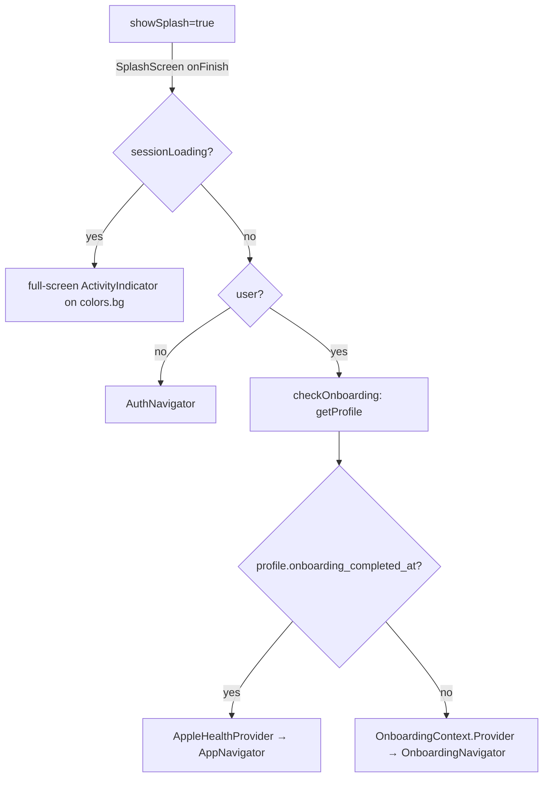

# Mobile App (Expo / React Native)

> Audience: engineers new to the RIVR codebase. This is the complete reference for the Expo / React Native client. It covers app bootstrap, navigation, session/token storage, the API client, theming, offline handling, Sentry, and every screen and major feature (onboarding, auth, home/score, document upload & scan, AI insights/Q&A, medical profile, timeline, Apple HealthKit, the iOS Emergency Card widget, and share/QR).

This document is part of the RIVR documentation set. For broader context, see:

- [Documentation Index & System Overview](./README.md)
- [Architecture Overview](./architecture-overview.md)
- [Backend Services (Django / DRF / Celery)](./backend-services.md)
- [AI Document Ingestion Pipeline & RAG Q&A](./ai-ingestion-and-qa.md)
- [Web App (Next.js)](./web-app.md) — companion site for the email-link reset/verify flows and the public share viewer
- [Data Model & End-to-End Flows](./data-model-and-flows.md)
- [Build, Deploy & Infrastructure](./build-deploy-infra.md)
- [Technology Stack Reference](./tech-stack.md)

The mobile client talks **only** to the Django/DRF backend over REST with JWT auth. There is no realtime transport (post-Supabase migration); every "live" surface is implemented with `setInterval` polling. Backend endpoint definitions referenced throughout live in [Backend Services](./backend-services.md); the document-processing job model is in [AI Ingestion & Q&A](./ai-ingestion-and-qa.md).

---

## 1. At a glance

| Property | Value | Source |
|---|---|---|
| Framework | Expo (managed) | `package.json` |
| Expo SDK | `~54.0.34` | `package.json` |
| React Native | `0.81.5` | `package.json` |
| React | `19.1.0` | `package.json` |
| New Architecture | **disabled** (`newArchEnabled: false`) | `app.json`, `ios/RIVRHealthAI/Info.plist` (`RCTNewArchEnabled false`) |
| Language | TypeScript | repo-wide |
| Navigation | `@react-navigation/native` `^7.1.26` + `native-stack` `^7.9.0` | `package.json` |
| Local storage | `@react-native-async-storage/async-storage` `2.2.0` | `package.json` |
| Deep-link scheme | `rivrhealth://` | `app.json` (`expo.scheme`) |
| Bundle id | `com.rivrhealth.app` (iOS + Android) | `app.json` |
| App Group (widget) | `group.com.rivrhealth.app` | `app.json`, `targets/widget/` |
| Apple team | `NUGFXB4PHG` | `app.json`, `eas.json` |
| EAS project id | `0b17b39a-c1e6-49f9-95e3-71acea501e8f` | `app.json` |
| Error tracking | `@sentry/react-native` `~7.2.0` | `package.json`, `src/lib/sentry.ts` |
| Tests | `vitest` `^4.1.6` | `package.json` |

Build/EAS/native config details (entitlements, the fmt Xcode patch, the `./dev` launcher) live in [Build, Deploy & Infrastructure](./build-deploy-infra.md). This doc focuses on the runtime application.

---

## 2. App bootstrap & provider tree

### 2.1 Entry point

`index.ts` registers the root component:

```ts
import { registerRootComponent } from 'expo';
import App from './App';
registerRootComponent(App); // AppRegistry.registerComponent('main', () => App)
```

This works identically in Expo Go and native builds.

### 2.2 Provider tree (`App.tsx`)

The default export is **`Sentry.wrap(App)`** — Sentry's root error-boundary / performance wrapper. Inside, the provider nesting is:

```
Sentry.wrap(App)
└── ThemeProvider            (src/context/ThemeContext.tsx)
    └── SessionProvider       (src/context/SessionContext.tsx)
        └── AppInner
            └── NetworkProvider        (src/context/NetworkContext.tsx)
                └── NavigationContainer (ref=navRef, linking=appLinking, theme=navTheme)
                    └── one of:
                        ├── AppleHealthProvider → AppNavigator   (auth + onboarded)
                        ├── OnboardingContext.Provider → OnboardingNavigator (auth, not onboarded)
                        └── AuthNavigator                        (signed out)
```

`navTheme` is derived with `useMemo` from React Navigation's `DefaultTheme`/`DarkTheme` (selected by `colorScheme`), overriding `colors.background = colors.bg`, `card = colors.surface`, `text`, `border`, and `primary = colors.teal` (`App.tsx:24-34`).

### 2.3 Bootstrap / gating sequence (`AppInner`)



Step by step (`App.tsx:36-93`):

1. `showSplash` starts `true`. `SplashScreen` renders until its animation calls `onFinish` → `setShowSplash(false)`. Session bootstrap runs in the background during the splash.
2. `useSession()` provides `{ user, loading: sessionLoading }`.
3. A `useEffect` fires once `sessionLoading` is false: if `user` exists it calls `checkOnboarding()` (`getProfile()` → `setOnboardingComplete(!!profile?.onboarding_completed_at)`; on error it `captureException(e)` and sets `false`); otherwise it sets `onboardingComplete=false`, `profileLoading=false`.
4. While `sessionLoading || (user && profileLoading)`, a full-screen teal `ActivityIndicator` is shown on `colors.bg`.
5. Routing (`showApp = !!user`):
   - `showApp && onboardingComplete` → `AppleHealthProvider` wrapping `AppNavigator`.
   - `showApp && !onboardingComplete` → `OnboardingContext.Provider` (`{ onComplete: () => setOnboardingComplete(true) }`) wrapping `OnboardingNavigator`.
   - else → `AuthNavigator`.

**Important gotchas**

- `AppleHealthProvider` is mounted **only** in the authenticated + onboarded branch, so `useAppleHealth()` is valid **only inside `AppNavigator` screens**. Calling it from Auth/Onboarding throws.
- `NetworkProvider` wraps all three navigators but sits **inside** `AppInner`, *after* the splash/loading branches — so the splash and the loading spinner have no network context.

### 2.4 Splash (`src/screens/SplashScreen.tsx`)

A pure animation gate. `expo-linear-gradient` `LinearGradient` from `colors.bg → colors.tealSoft`. Animated sequence: logo fade+scale (0.8→1, 400 ms), the app name "RIVR Health" fade+slide, the tagline "Your health, organized.", then a final ~600 ms hold, then `onFinish()`. Uses the shared `AuthLogo` component and the `createStyles` hook pattern.

---

## 3. Navigation

All three stacks use `@react-navigation/native-stack` `createNativeStackNavigator`. They are **separate, sibling stacks swapped at the `App.tsx` level** (not nested), based on session + onboarding state.

### 3.1 The imperative nav ref (`src/navigation/navRef.ts`)

```ts
export const navRef = createNavigationContainerRef<any>();
```

Attached to `NavigationContainer`, this lets non-component code navigate imperatively.

### 3.2 App stack — `AppNavigator.tsx` (authenticated + onboarded)

`initialRouteName="Home"`. `screenOptions` is a function of `{ navigation }`: header background `colors.bg`, no shadow, title style from `typescale` (`size.md`, `weight.semibold`, `color colors.text`, `letterSpacing -0.2`), `headerTintColor = colors.teal`, content background `colors.bg`, `headerBackVisible=false`, and a custom circular `headerLeft` Pressable with `Ionicons "chevron-back"` (teal), shown only when `canGoBack`.

| Route | Component | Header title | Notes |
|---|---|---|---|
| `Home` | `HomeScreen` | — (`headerShown:false`) | Dashboard |
| `ManageDocuments` | `ManageDocumentsScreen` | "Documents" | Upload/scan/voice + doc list |
| `Share` | `ShareScreen` | "Share Records" | QR / secure-link generator |
| `Timeline` | `TimelineScreen` | "Timeline" | Event list + AI Q&A search |
| `ShinScore` | `ShinScoreScreen` | "SHIN Score" | Score detail |
| `HealthSummary` | `HealthSummaryScreen` (default export) | "AI Health Summary" | Summary + 3×5 card; **widget deep-link target** |
| `AIInsights` | `AIInsightsScreen` | "AI Recommendations" | Full recommendations |
| `PreVisitNote` | `PreVisitNoteScreen` | "Pre-Visit Note" | Selected events note |
| `Details` | `TimelineEventDetailsScreen` | "Event Details" | Single event |
| `Profile` | `ProfileScreen` | "My Profile" | Personal profile + settings |
| `MedicalProfile` | `MedicalProfileScreen` | "Medical Profile" | Clinical lists editor |
| `Story` | `StoryScreen` | "Your Health Story" | 10-question narrative |
| `AppleHealth` | `AppleHealthScreen` | "Apple Health" | HealthKit dashboard |

`appTypes.ts` (`AppStackParamList`): the only params are `Details: { id: string }` and `AppleHealth: { initialMetric?: "sleep" | "steps" | "heartRate" } | undefined`. Every other route is `undefined`.

### 3.3 Auth stack — `AuthNavigator.tsx` (signed out)

Reads `AsyncStorage.getItem("rivr_welcome_seen")` (`WELCOME_KEY`). `initialRoute = "Login"` if the value is `"true"`, else `"Welcome"`. Renders `null` until that async read resolves (prevents flicker, but can briefly show blank). `screenOptions` sets `headerShown: false` globally and theme-colored header/content backgrounds.

Screens: `Welcome`, `Login`, `SignUp`, `ForgotPassword`, `UpdatePassword`.

### 3.4 Onboarding stack — `OnboardingNavigator.tsx` (signed in, not onboarded)

`initialRouteName="OnboardingStep1"`, `headerShown:false`, `animation:"slide_from_right"`, content background `colors.bg`. Screens: `OnboardingStep1`, `OnboardingStep2`, `OnboardingStep3` (all params `undefined`).

### 3.5 Deep linking (`src/navigation/linking.ts`)

`appLinking: LinkingOptions` with `prefixes: ["rivrhealth://"]`. The scheme `rivrhealth` is declared in `app.json` (`expo.scheme`) and in the native iOS/Android config (see [Build, Deploy & Infrastructure](./build-deploy-infra.md)).

| Route | Path |
|---|---|
| `Login` | `auth/confirmed` |
| `UpdatePassword` | `auth/reset` |
| `Home` | `""` |
| `ManageDocuments` | `documents` |
| `Share` | `share` |
| `Timeline` | `timeline` |
| `ShinScore` | `shin-score` |
| `HealthSummary` | `health-summary` ← **widget tap target** (`rivrhealth://health-summary`) |
| `AIInsights` | `ai-insights` |
| `PreVisitNote` | `pre-visit` |
| `Profile` | `profile` |
| `MedicalProfile` | `medical-profile` |
| `Story` | `story` |
| `AppleHealth` | `apple-health` |

Notes:

- `RootLinkingParamList` is a **flat union** of auth + app routes even though they live in different stacks. `Login` (`auth/confirmed`) and `UpdatePassword` (`auth/reset`) target the auth flow — these are the deep links the [web app](./web-app.md) emits after email verify / password reset (`rivrhealth://auth/confirmed`).
- `Details` exists in `AppNavigator` but is **not** in the `linking.ts` map, so it is not deep-linkable.
- `src/navigation/linking.test.ts` asserts these prefixes/paths so release-QA deep links stay addressable.

---

## 4. Session, token storage & auth

### 4.1 SessionContext (`src/context/SessionContext.tsx`)

`SessionValue`:

```ts
{
  user: ApiUser | null;
  loading: boolean;
  signIn(email, password): Promise<ApiUser>;
  signUp(email, password): Promise<ApiUser>;
  signOut(): Promise<void>;
}
```

- On mount, `load()`: if `getAccessToken()` returns a token, it calls `apiAuth.me()`; on success it sets `user` and `applyUser(me)`; on failure it `clearTokens()` and clears the user. `loading` is always set false at the end. **If there is no access token, `me()` is skipped** but `loading` still becomes false.
- `applyUser(user)` side-effects: `setCurrentUserId(user?.id ?? null)` (updates the `src/lib/auth.ts` cache so non-React helpers can read the current user id) and `setUser({id,email} | null)` on Sentry.
- On mount it registers `setUnauthorizedHandler(() => { setUser(null); applyUser(null); })`; cleanup resets it to `null`. **This is the bridge that lets the API client force a logout to Login when a 401 cannot be refreshed.**
- `signIn = apiAuth.login`, `signUp = apiAuth.register`, `signOut = apiAuth.logout` — each updates `user` + `applyUser`.
- `useSession()` throws `"useSession must be used within a SessionProvider"` if no provider is present.

### 4.2 Cached user id (`src/lib/auth.ts`)

Module-level `cachedUserId`, kept in sync by `SessionProvider` via `setCurrentUserId(id|null)`. `getCurrentUserId()` returns the cache, or falls back to `me()`, and throws if unauthenticated. This lets non-React data helpers (e.g. `upsertManualInputDocument`) read the current user without prop drilling.

### 4.3 Token storage

Tokens live in `AsyncStorage` under these keys (`src/lib/api/client.ts`):

| Key | Contents |
|---|---|
| `rivr.access` | JWT access token (30-min lifetime, set by the backend) |
| `rivr.refresh` | JWT refresh token (30-day lifetime, rotated on refresh) |

Helpers: `setTokens(access, refresh?)` (`AsyncStorage.multiSet`, refresh optional), `clearTokens()` (`multiRemove`), `getAccessToken()`, `getRefreshToken()`.

Other AsyncStorage keys used by the app:

| Key | Purpose | Owner |
|---|---|---|
| `rivr_welcome_seen` | Skip Welcome screen after first run | `AuthNavigator.tsx` |
| `rivr_theme_preference` | system / light / dark preference | `ThemeContext.tsx` |
| `addWidgetCard.dismissed.v1` | Hide the "add the widget" how-to card | `AddWidgetCard.tsx` |

### 4.4 Auth API (`src/lib/api/auth.ts`)

`ApiUser = { id: string; email: string; is_email_verified: boolean; date_joined: string }`.

| Function | Method + path | Behavior |
|---|---|---|
| `register(email,password)` | `POST /api/auth/register` | Response `{user, access, refresh}` → stores tokens → returns `user` |
| `login(email,password)` | `POST /api/auth/login` | Same shape → stores tokens → returns `user` |
| `logout()` | `POST /api/auth/logout {refresh}` | Reads refresh token; POSTs if present; **always** `clearTokens()` in `finally` |
| `me()` | `GET /api/auth/me` | Returns `ApiUser` |

These backend endpoints are defined in [Backend Services](./backend-services.md). Note registration immediately returns JWTs (no email-verification gate).

---

## 5. API client (`src/lib/api/`)

### 5.1 `client.ts` — fetch wrapper, refresh, errors

- **Base URL:** `const BASE = process.env.EXPO_PUBLIC_API_URL ?? "http://localhost:8000"`. The committed `.env` sets it to `http://localhost:8001` (the local coexistence port). For a physical device you must set a LAN IP. See [Build, Deploy & Infrastructure](./build-deploy-infra.md).
- **`ApiError extends Error`:** fields `status: number`, `data: unknown`. The message is `data.detail` when present, else `Request failed (${status})`; `name = "ApiError"`.
- **`request<T>(path, opts)`** — the core wrapper. `RequestOpts = { method="GET"; body?; isForm=false; retry=true }`:
  - Adds `Authorization: Bearer <accessToken>` when a token exists.
  - If `isForm`, the body is passed through unchanged (a `FormData`; **no `Content-Type` is set** so the runtime adds the multipart boundary). Otherwise, if a body is defined, it sets `Content-Type: application/json` and `JSON.stringify`s it.
  - `fetch(`${BASE}${path}`, …)`.
  - **Refresh-on-401:** if `res.status === 401 && retry && (await tryRefresh())`, it recurses with `{...opts, retry:false}` — a **single** retry, no loop.
  - If still 401 (refresh absent/failed): `await clearTokens(); onUnauthorized?.();` then throws an `ApiError(401, …)` after parsing the body.
  - On any other `!res.ok`, throws `ApiError(res.status, data)`. Empty body → `null`.
- **`tryRefresh()`** — `POST ${BASE}/api/auth/token/refresh` with `{ refresh }`. On `res.ok` it `setTokens(data.access, data.refresh)` (**rotates both** — the backend has `ROTATE_REFRESH_TOKENS=True`) and returns `true`; returns `false` if there is no refresh token or the response is not ok.
- **`api` helper:** `get`, `post`, `patch`, `put`, `del`, plus `upload(p, form)` (`POST` with `isForm:true`).

`client.test.ts` verifies: the Bearer header is attached, refresh + retry on 401 (3 `fetch` calls; new access stored under `rivr.access`), the unauthorized handler fires + tokens are cleared when refresh is impossible, and the `ApiError` `{status, message}` shape on failure.

#### The 401 / forced-logout flow

```mermaid
sequenceDiagram
  participant Screen
  participant request as request()
  participant API as Django API
  participant Session as SessionContext

  Screen->>request: api.get('/api/...')
  request->>API: fetch + Bearer access
  API-->>request: 401 Unauthorized
  request->>API: POST /api/auth/token/refresh {refresh}
  alt refresh ok
    API-->>request: {access, refresh}
    request->>request: setTokens(); retry once (retry:false)
    request->>API: fetch + new Bearer
    API-->>request: 200
    request-->>Screen: data
  else refresh missing/failed
    request->>request: clearTokens()
    request->>Session: onUnauthorized()
    Session->>Session: setUser(null)
    Note over Session: app routes back to AuthNavigator (Login)
    request-->>Screen: throw ApiError(401)
  end
```

### 5.2 `data.ts` — domain REST calls

All return types are loosely typed (`any` in most cases). Endpoint contracts are defined backend-side in [Backend Services](./backend-services.md) and the [AI pipeline doc](./ai-ingestion-and-qa.md).

| Helper | Method + path | Notes |
|---|---|---|
| `getProfile()` | `GET /api/profile` | |
| `updateProfile(patch)` | `PATCH /api/profile` | |
| `linkHealth()` | `POST /api/profile/link-health` | Sets `health_linked_at = now()` |
| `unlinkHealth()` | `POST /api/profile/unlink-health` | Clears `health_linked_at` |
| `getAvatar()` | `GET /api/profile/avatar` | `{ avatar_path, url \| null }` |
| `uploadAvatar(image)` | `POST /api/profile/avatar` (multipart `image`) | |
| `getHealthProfile()` | `GET /api/health-profile` | Returns `null` on `ApiError 404` |
| `getLatestEvaluation()` | `GET /api/health-evaluations/?limit=1` | `results[0] ?? null` |
| `listDocuments(query)` | `GET /api/documents/${query}` | `{ count, results }` |
| `uploadDocument(file, sourceType, title?)` | `POST /api/documents/upload/` (multipart `file`,`source_type`,`title`) | |
| `deleteDocument(id)` | `DELETE /api/documents/${id}/` | |
| `enqueueDocumentProcessing(ids[])` | `POST /api/jobs/enqueue {documentIds}` | → `jobId` |
| `enqueueProfileEvaluation()` | `POST /api/jobs/enqueue {jobType:"profile_evaluation"}` | → `jobId` |
| `listJobs(query)` | `GET /api/ai-jobs/${query}` | |
| `cancelJob(id)` | `POST /api/ai-jobs/${id}/cancel/` | |
| `listTimeline(query)` | `GET /api/timeline-events/${query}` | |
| `getTimelineEvent(id)` | `GET /api/timeline-events/${id}/` | |
| `updateTimelineEvent(id, patch)` | `PATCH /api/timeline-events/${id}/` | |
| `createTimelineEvents(events[])` | `POST /api/timeline-events/` (array body → bulk) | |
| `deleteTimelineEvent(id)` | `DELETE /api/timeline-events/${id}/` | |
| `createShare(shareTypes[], pin?)` | `POST /api/shares {shareTypes, pin}` | → `{ shareUrl, expiresAt }` |
| `askHealthQuestion(question)` | `POST /api/qa {question}` | → `{ answer, sources }` |

> **Trailing-slash gotcha.** The convention is inconsistent and must match DRF's routing: **auth + profile + health-profile endpoints have NO trailing slash** (`/api/profile`, `/api/auth/me`, `/api/health-profile`, `/api/jobs/enqueue`, `/api/shares`, `/api/qa`), while **documents/jobs/timeline/health-evaluations have a trailing slash** (`/api/documents/`, `/api/ai-jobs/`, `/api/timeline-events/`, `/api/health-evaluations/`).

One call bypasses `data.ts`: **account deletion** is done raw in `ProfileScreen.tsx` against `` `${process.env.EXPO_PUBLIC_API_URL}/api/account/delete/` `` (see §13.2).

`src/lib/api/index.ts` is a barrel re-exporting `client`, `auth`, and `data`.

---

## 6. Theming & design tokens (`src/theme/`)

### 6.1 ThemeContext (`src/context/ThemeContext.tsx`)

- `Preference = "system" | "light" | "dark"`, persisted to `AsyncStorage` under `rivr_theme_preference`.
- Resolution: `systemScheme = useColorScheme() ?? "light"`; effective `colorScheme = preference === "system" ? systemScheme : preference`; `colors = resolved === "dark" ? darkColors : lightColors`.
- `setPreference(pref)` updates state and persists.
- Value: `{ colorScheme, colors, preference, setPreference }`. The default context value uses the light theme. `useTheme()` is the hook; it re-exports the `Colors` type.

### 6.2 Tokens (`src/theme/tokens.ts`)

`lightColors` / `darkColors` (typed `Colors = typeof lightColors`). The primary accent is teal:

| Token | Light | Notes |
|---|---|---|
| `teal` | `#1FADA6` | Primary accent (also `navTheme.primary`, widget `$accent`, web `teal`) |
| `tealMid` | `#2CB9B0` | |
| `tealSoft` | `#E6FAF8` | Splash gradient end, soft fills |
| `tealBorder` | `rgba(31,173,166,0.25)` | |
| `bg` | `#F5F8FA` (dark `#0D1B2A`) | App background |
| `surface` | `#FFFFFF` (dark `#1E293B`) | Cards |
| `text` | `#0D1B2A` (dark `#F1F5F9`) | |
| `danger` | `#DC2626` | Emergency red (also widget red) |

`export const colors = lightColors` is a backward-compat alias — prefer `useTheme().colors` in components. The same hex values (`teal #1FADA6`, `ink #0D1B2A`) are reused in the [web app](./web-app.md) Tailwind theme and the native widget colorset, so the brand stays consistent.

Other token groups: `typescale` (`size {xs:11…hero:32}`, `weight {regular:"400"…black:"900"}`, `lineHeight`), `spacing` (`xxs:4…xxl:32`), `radius` (`xs:6…pill:999`), `shadows` (iOS shadow + Android elevation), `fonts` (`Platform.select` ios "System" / android "Roboto").

### 6.3 `createStyles` pattern (`src/theme/createStyles.ts`)

```ts
createStyles<T>(factory: (colors) => T): () => T
```

`createStyles` returns a **hook** that reads `useTheme().colors` and `useMemo`s `factory(colors)`, so `StyleSheet.create` re-runs only when the light↔dark palette changes. This is the standard styling pattern across screens.

`src/lib/branding.ts` centralizes asset refs (e.g. `logoIconFullcolor = require("../../assets/branding/logo-icon-fullcolor.png")`) so artwork can be swapped without code changes.

---

## 7. Offline handling (`src/context/NetworkContext.tsx`)

Uses `@react-native-community/netinfo` (`11.4.1`). State shape: `{ isConnected: boolean }`, default `true`.

- **Web** (`Platform.OS === "web"`): uses `navigator.onLine` plus `online`/`offline` window listeners.
- **Native:** subscribes via `NetInfo.addEventListener`, mapping `netState.isConnected ?? true`.

`useNetwork()` is the hook. The UI surfaces this through `OfflineBanner` (`src/components/ui/Primitives/OfflineBanner.tsx`).

> **This is a UI signal only.** There is **no request queueing, no offline cache, no retry**. Connectivity is a boolean. Because `NetworkProvider` mounts inside `AppInner` after the splash/loading branches, the splash and loading spinner have no network context.

---

## 8. Sentry (`src/lib/sentry.ts`)

- `import * as Sentry from "@sentry/react-native"` (`~7.2.0`).
- DSN from `process.env.EXPO_PUBLIC_SENTRY_DSN || ""`. Init **only if a DSN is set**:
  ```ts
  Sentry.init({
    dsn,
    enabled: !__DEV__,
    tracesSampleRate: 0.2,
    environment: __DEV__ ? "development" : "production",
  });
  ```
  So **Sentry is effectively disabled in dev** even with a DSN (`enabled: !__DEV__`).
- Exports: `captureException`, `captureMessage(message, level?)`, `setUser({id,email} | null)`, and re-exports `Sentry`. The root app is wrapped via `Sentry.wrap(App)` in `App.tsx`. `SessionContext` calls `setUser` whenever the session changes, so crashes are attributed to the current user.

---

## 9. How the UI tracks backend job status (polling)

There is **no realtime**. Every "live" surface polls with `setInterval`. The canonical implementation is `ListDocuments.tsx` (§11.4), but the same pattern recurs:

| Surface | Interval | What it polls |
|---|---|---|
| `ListDocuments` (docs) | **4000 ms** | `listDocuments("?exclude_status=processed&offset=0&limit=100&ordering=-created_at")` |
| `ListDocuments` (jobs) | **1500 ms** (only while `hasProcessingDocs`) | `listJobs("?status__in=queued,running&limit=100")` |
| `HealthSummaryScreen` | **4000 ms** | reload health profile/eval while the worker writes `health_profiles` |
| `StoryScreen` | 3000 ms, up to **60 s** | wait for a fresh `health_profile.updated_at` after a re-eval |
| `ShinScoreScreen` | on focus + poll loop | latest job status + profile |

### 9.1 The stage → progress map (`STAGE_INFO`)

`ListDocuments.tsx:51-64` mirrors the worker's `stage` field (set by `apps/jobs/pipeline.py`, see [AI Ingestion & Q&A](./ai-ingestion-and-qa.md)) to a UI label + percent:

| Worker stage | Label | Percent |
|---|---|---|
| `started` | Starting | 1 |
| `fetching_documents` | Reading record | 5 |
| `downloading_file` | Downloading | 15 |
| `extracting_text` | Extracting text | 30 |
| `transcribing_audio` | Transcribing audio | 35 |
| `ocr_pdf` | Reading scanned text | 45 |
| `safe_quitting` | Stopping | 50 |
| `openai_extract` | Analyzing with AI | 65 |
| `document_done` | Almost done | 80 |
| `loading_manual_profile` | Loading profile | 85 |
| `openai_eval` | Evaluating health | 90 |
| `saving_profile` | Saving | 95 |
| `ai_backfill` | Updating profile | 98 |

The jobs poll routes each job's stage to a per-document `jobStage` map using `job.progress.currentDocId` (falling back to `job.document_ids[]`). Because the percents are hardcoded in the client, they must be kept in sync if the backend renames a stage.

---

## 10. The upload → process → score data flow

This is the central end-to-end flow that several screens participate in. (Backend specifics: [AI Ingestion & Q&A](./ai-ingestion-and-qa.md); data model: [Data Model & Flows](./data-model-and-flows.md).)

```mermaid
flowchart TD
  U[User uploads/scans a file] -->|POST /api/documents/upload/| D[(Document status=uploaded)]
  U2[User taps Process] -->|POST /api/jobs/enqueue {documentIds}| J[(AiJob status=queued)]
  J -->|Celery worker runs pipeline.run_job| P[Extract → OCR → LLM facts → embeddings → evaluation]
  P --> HP[(HealthProfile: score, card_json, summary_json)]
  P --> TL[(TimelineEvent source=document_ai)]
  ListDocuments -. poll 1.5s .-> J
  HomeScreen -. on focus .-> HP
  HealthSummary -. poll 4s .-> HP
  HP -->|syncEmergencyCardToWidget| W[iOS Emergency Card widget]
```

Key client facts:

- **Upload does not process.** `uploadDocument` only creates an `uploaded` Document. The client must separately `enqueueDocumentProcessing([ids])` to start the pipeline (`ManageDocumentsScreen.startProcessing()`). There are no backend signals tying the two together.
- **Manual-input doc.** `MedicalProfileScreen` maintains exactly one `source_type=manual_input` document via `upsertManualInputDocument`, and re-evaluation is triggered through `enqueueProfileEvaluation` / a `beforeRemove` nav listener (§13.3).
- **Widget freshness.** `HomeScreen` and `HealthSummaryScreen` call `syncEmergencyCardToWidget(...)` whenever they load profile data (§15).

---

## 11. Documents: upload, scan, voice & job-status UI

### 11.1 ManageDocuments hub (`src/screens/App/ManageDocumentsScreen.tsx`)

- The header-right badge shows `pendingCount` (docs with `status=uploaded`).
- `startProcessing()`: `listDocuments("?status=uploaded&ordering=created_at")` → `enqueueDocumentProcessing(ids)` → `POST /api/jobs/enqueue`.
- The footer button text comes from `documentProcessingFooterCopy({starting, pendingCount, message})` (`src/lib/documentProcessingUi.ts`): "Process N items" / "Processing started" / "Nothing to process". Covered by `documentProcessingUi.test.ts`.
- Hosts `<UploadFile>`, `<RecordVoiceNote>`, and `<ListDocuments>`.

### 11.2 Upload & scan (`src/components/ui/ManageDocuments/UploadFile.tsx`)

Two actions live in one card: **Upload PDF** and **Scan Document**.

**Upload PDF (`handlePdf`)**

- `expo-document-picker` `getDocumentAsync({ type:"application/pdf", multiple:true, copyToCacheDirectory:true })`.
- Per-asset **duplicate check**: `listDocuments("?title=<name>")` matched on `size_bytes`. On a match it shows an in-app `DuplicateConfirmModal` (a `BottomSheet`) — **not** `Alert.alert`, because `Alert` renders nothing on web.
- Uploads via `uploadDocument(file, "pdf")`.

**Scan Document (`handleStartScan` → `ScanModal`)**

- Camera/library capture builds an ordered array of `ScanPage { id, uri, mimeType, width, height }`.
- Constants: `MAX_SCAN_PAGES=20`, `MAX_SCAN_WIDTH=1800`, `SCAN_COMPRESS=0.82`.
- Capture via `expo-image-picker` (`launchCameraAsync` / `launchImageLibraryAsync`, `mediaTypes:"images"`, quality 0.75, multi-select for library). Pages can be reordered (←/→) and removed; the UI shows a thumbnail strip + a stacked `PageDeck` preview.
- **Permissions:** native requests are explicit (`requestCamera/MediaLibraryPermissionsAsync`); web skips (the browser handles it). Denial copy comes from `nativePermissions.ts`.

**PDF compilation — the platform split**

This is the most important detail in the scan flow. The image pages are compiled into a single PDF differently per platform:

| Platform | Module | Mechanism |
|---|---|---|
| Native (iOS/Android) | `handleUploadScan` in `UploadFile.tsx` | Each page `prepareNativePage`: if `width > 1800`, `expo-image-manipulator.manipulateAsync([{resize:{width:1800}}], {compress:0.82, format:JPEG})`; read base64 via `expo-file-system/legacy`. Build one HTML doc with `` per page (`page-break-after:always`), render via `expo-print.printToFileAsync({html})` → temp PDF (deleted in `finally`). Upload as `scanned_pdf`. |
| Web | `src/lib/scanPdf.web.ts` (Metro resolves `.web.ts`) | `compileScanPagesForWeb(pages)` uses `@cantoo/pdf-lib`: each image resized to ≤1800 px and JPEG-encoded at 0.82 on a canvas, embedded via `embedJpg`, saved to a `Uint8Array`, wrapped in a `Blob`/`File`, uploaded as `scanned_pdf`. |

`src/lib/scanPdf.ts` is a **native stub that throws** — only the `.web.ts` variant is real, and `UploadFile` imports it unconditionally (Metro picks the platform variant).

**Web memory hygiene:** `revokeScanPageUrls` calls `URL.revokeObjectURL` on `blob:` URIs at remove/discard/success/close.

`documentScanFlow.test.ts` asserts that `handleStartScan` opens the session before asking for a source (`setScanOpen(true)`, no `takeCameraPhoto`/`Platform.OS` branch) and that the entry copy includes "Take photos or choose images".

### 11.3 Voice notes (`src/components/ui/ManageDocuments/RecordVoiceNote.tsx`)

`expo-av` `Audio` recording, uploaded via `uploadDocument`; the filename is sanitized by `safeFilename` (`src/lib/documents.ts`). The backend transcribes audio with Whisper (25 MB limit) — see [AI Ingestion & Q&A](./ai-ingestion-and-qa.md).

### 11.4 Document list & job status (`src/components/ui/ManageDocuments/ListDocuments.tsx`)

The canonical "track backend job status" component. Two polling loops:

1. **Docs poll, every 4000 ms** — `listDocuments("?exclude_status=processed&offset=0&limit=100&ordering=-created_at")`. Diffs against local state: new docs spring in, processed docs animate out with a green flash, deletes animate out with a red flash.
2. **Jobs poll, every 1500 ms** (only while `hasProcessingDocs`) — `listJobs("?status__in=queued,running&limit=100")`. Reads `job.stage`, maps it via `STAGE_INFO` (§9.1) to `{label, percent}`, and routes to the per-doc `jobStage` map by `job.progress.currentDocId` or `job.document_ids[]`.

Per card: a real-percent `ProgressBar` (JS-driven width) once a stage is known, else an indeterminate `ShimmerBar`; rotating placeholder messages (`PROCESSING_MESSAGES` / `_MANUAL` / `STOPPING_MESSAGES`).

- `StatusBadge` maps `uploaded→Ready`, `queued→Queued`, `processing→Analyzing`, `stopping→Stopping`, `failed→Failed`.
- `FileTypeIcon` maps `manual_input→PRO`, `scanned_pdf→SCAN`, `image_*→IMG`, audio→`MIC`, else `PDF`.
- Stop processing (`runCancel`) shows "Stopping…" immediately; the worker reverts the doc status. A `ConfirmModal` (BottomSheet) guards delete/cancel. Pagination is 20/page (`DOC_PAGE_SIZE`) with pull-to-refresh.

### 11.5 Document lifecycle helpers (`src/lib/documents.ts`)

- `deleteDocument(docId, …)` → `DELETE /api/documents/{id}/`. Server-side cascades remove dependent rows (timeline events `SET_NULL`, embeddings `CASCADE`).
- `cancelProcessing(docId)`: finds the active job via `GET /api/ai-jobs/?status__in=queued,running&contains_document_id=<id>&limit=1`, then `POST /api/ai-jobs/{id}/cancel/`. The worker reverts the doc status cooperatively.
- `upsertManualInputDocument(userId)`: maintains exactly one `source_type=manual_input` document (backend has a partial unique index). It snapshots a `content_json` (counts of allergies/meds/etc.), resets status to `uploaded` and clears `processing_error`/`processed_at` on change, and **deletes** the doc when no meaningful data remains.

Source types observed across the client: `pdf`, `scanned_pdf`, `manual_input`, legacy `image_gallery`/`image_camera`, and audio (voice note).

---

## 12. Home, score & AI insights/Q&A

### 12.1 Home dashboard (`src/screens/App/HomeScreen.tsx`)

Reloads on focus (`useFocusEffect`). Parallel load: `getHealthProfile()`, `getLatestEvaluation()`, `getProfile()`, `listDocuments("?status=processed")`.

- **Score** resolves to `healthProfile?.score ?? evalResult?.score_0_to_100 ?? null`; the label to `score_label`. Rendered with `ScoreRing` (`src/components/ui/Home/ScoreRing.tsx`).
- **Widget sync (every focus):** `syncEmergencyCardToWidget(healthProfile?.card_json ?? evalResult?.three_by_five_card ?? null, healthProfile?.updated_at)` keeps the iOS widget fresh (§15).
- **Recommendations:** top 3 via `buildRecommendations(summary_json, evalResult)` (§12.4).
- **Staleness flag:** if the latest processed doc's `processed_at` is newer than the eval's `created_at`, a "Summary outdated" badge links to `HealthSummary`.
- **Quick actions:** Documents / Timeline / Pre-Visit / Share. A dual card row shows `AiSuggestionsCard` (→ AIInsights) and `AppleHealthMiniCard` (driven by `useAppleHealth()`; sleep/steps/heartRate pills deep-link to `AppleHealth` with `initialMetric`).

### 12.2 SHIN Score (`src/screens/App/ShinScoreScreen.tsx`)

Loads `getLatestJob()` (`GET /api/ai-jobs/?limit=1&ordering=-created_at`), `getHealthProfile`, `getLatestEvaluation`. Polls for job status (`pollRef`). Remounts `ScoreRing` on focus to replay the animation. The "Generate" CTA navigates to `ManageDocuments`.

### 12.3 Health Summary (`src/screens/App/HealthSummaryScreen.tsx`, default export)

Parallel load: `getHealthProfile`, `getLatestEvaluation`, `getProfile`, plus a raw `GET /api/documents/?limit=1&offset=0&status=processed&ordering=-processed_at`.

- **Polls every 4000 ms** to reload while the worker writes `health_profiles`.
- Derived data: `overview`, `full_summary_markdown`, `card_json` (the 3×5 Emergency Card), and source tags (`Profile`/`Records`/`Apple Health`) from `profile.sources`.
- **Staleness + auto re-eval:** compares `profile.sources.manual_profile.signature` to the live `manualProfileSignature(userProfile)`, and the latest doc `processed_at` vs the eval `created_at`; if stale, it fires `triggerProfileEvalAfterSave()` once (guarded by `hasTriggeredRef`).
- Syncs the widget (`syncEmergencyCardToWidget`) and renders `<AddWidgetCard>` (the iOS "add the widget" how-to, §15.4). The Essentials rows map blood type, conditions, surgeries, meds, allergies, implants, anticoagulants, anesthesia, and emergency contact.

### 12.4 AI Insights (`src/screens/App/AIInsightsScreen.tsx`)

Loads `getHealthProfile()` + `getLatestEvaluation()`, builds the full list via `buildRecommendations(summary_json, evalResult)`.

- `RecommendationCard` does **real line-count truncation detection** using hidden absolute-positioned `<AppText onTextLayout>` measurers compared to `TITLE_CLAMP=2` / `BODY_CLAMP=3` for See more / Show less.
- Action pills route: `navigate_documents`→ManageDocuments, `navigate_profile`→MedicalProfile, `navigate_apple_health`→AppleHealth.
- The disclaimer comes from `summary_json.disclaimer ?? evaluation.disclaimer` with a hardcoded fallback.

**Recommendations engine (`src/lib/recommendations.ts`).** `buildRecommendations(summaryJson, evalResult)` → `RecommendationItem[]` capped at `MAX_RECS=6`:

- **Structured path (preferred):** `summary_json.recommendations[]` or `evalResult.recommendations[]` → `normalizeStructuredRec`. `STRUCTURED_CATEGORY_MAP` maps backend categories (`follow_up/missing_info/monitoring/lifestyle/safety/medication/preventive`) to display categories; priority is `high|medium|low`.
- **Legacy fallback:** `missing_info` (medium), `suggested_next_steps` (generic lifestyle suppressed via `GENERIC_LIFESTYLE_RE`), and actionable `risk_flags` (must match `ACTIONABLE_FLAG_RE`). Highlights are intentionally excluded.
- `inferAction(text)` infers a CTA: Apple-Health keywords → `Connect Health`/`navigate_apple_health`; schedule/clinician → no CTA; default `Add Data`/`navigate_documents`. `resolveActionPair` discards `navigate_profile`/"Edit Profile".
- `filterAndSort`: Safety items require `high`; lifestyle must pass a specificity check; sorts by `CATEGORY_SORT_ORDER`, then priority.

### 12.5 AI Q&A (`src/lib/aiQuestionSearch.ts`)

`askHealthQuestion(question)` trims, calls the API helper (`POST /api/qa`), and normalizes up to 5 sources (`{title,type?,detail?}` derived from `title|name|label`). The result is a union: `idle | answered{answer,sources} | unavailable{message}`. **Any throw → `unavailable`** with a fixed message. This is consumed inline by the Timeline search bar (§14).

The backend RAG implementation (vector retrieval + LLM, the `OPENAI_API_KEY` gate that 503s) is in [AI Ingestion & Q&A](./ai-ingestion-and-qa.md).

---

## 13. Profile, medical profile & story

### 13.1 Onboarding (3 steps, `src/screens/Onboarding/`)

- **Step 1:** first/last name, DOB, sex → `upsertProfile`.
- **Step 2:** email/phone/occupation/marital/children.
- **Step 3:** emergency contact (all optional, with "Skip for now"); sets `onboarding_completed_at` and calls `onComplete()` (from `OnboardingContext`), which flips `onboardingComplete` in `AppInner` and switches to `AppNavigator`.

Each step pre-loads the existing profile so re-entry is non-destructive.

### 13.2 Profile + settings (`src/screens/App/ProfileScreen.tsx`)

Sections (each a `SectionCard` with inline edit): Basic Information (name/DOB/sex; DOB via `formatDobAsTyped`/`parseDob` + `DatePickerModal`), Personal Details, Contact (email disabled, `PhoneField`), Emergency Contact. A completion bar measures `REQUIRED_FIELDS`/`ALL_FIELDS`.

- **Avatar:** `AvatarPickerSheet` → `launchPicker("camera"|"library")` via `expo-image-picker` (1:1 aspect, quality 0.9) → `uploadAvatar(file)` (`POST /api/profile/avatar`). Remove sets `avatar_path:null`. Uses `nativePermissions.ts` helpers.
- **Appearance:** a segmented control (system/light/dark) wired to `useTheme().setPreference`.
- **Account card:** Privacy Policy (`https://rivrhealth.ai/privacy-policy`); **Sign Out** calls `clearEmergencyCardWidget()` then `signOut()`.
- **Danger Zone — Delete Account:** an `Alert.alert` confirm, then a **raw** `POST ${process.env.EXPO_PUBLIC_API_URL}/api/account/delete/` (note: this is the only call that bypasses the `data.ts`/`api` layer), then `clearEmergencyCardWidget()` + `signOut()`.
- Also links to `MedicalProfile` and `Story`.

### 13.3 Medical Profile (`src/screens/App/MedicalProfileScreen.tsx`)

The clinical-lists editor. Sections: Lifestyle (smoking/alcohol/exercise pills), Current Symptoms (free text, 2000 cap), Allergies, Medications, Medical History, Surgical History, Family History, Hospitalizations, Social History.

- Each list item is `{ id, … }` with `makeId()`; add forms auto-commit a valid in-progress entry on Save (avoids a stale-closure race).
- `persist(patch)`: `upsertProfile` then compares `manualProfileSignature` before/after; if it changed, it calls `upsertManualInputDocument(userId)` (re-creates the canonical Manual Health Profile doc → status `uploaded`).
- **`beforeRemove` nav listener:** on leaving the screen, `enqueueManualProfileIfPending()` finds the `manual_input` doc with status `uploaded` and `enqueueDocumentProcessing([id])` — so **leaving the screen (not Save) is what enqueues** the re-evaluation.

### 13.4 Story (`src/screens/App/StoryScreen.tsx`)

10 fixed coaching questions (`q1`–`q10`; the keys are stable in the DB, the text lives in the screen — and must stay in sync with the backend's `STORY_QUESTION_LABELS`). Edits persist via `upsertProfile({story_answers})`. After save it shows "Refreshing your health summary…" and **polls up to 60 s** (3 s interval) for a fresh `health_profile.updated_at` or eval after `triggerProfileEvalAfterSave()`.

---

## 14. Timeline (`src/screens/App/TimelineScreen.tsx`)

- Loads `listTimeline("?limit=30&offset=...&exclude_source=apple_health&ordering=-occurred_at")` — paginated 30/page, infinite scroll, pull-to-refresh. (Apple Health events are excluded here because they are high-volume/noisy; they live on the Apple Health screen instead.)
- Rows are normalized via `normalizeTimelineEvent` (`src/lib/timeline.ts`, which also exposes `normalizePrecision`, `formatTimelineDateMain/Detail`, `buildTimelineEventSavePayload`, `clinicalTagsForEvent`, `DatePrecision = "day"|"month"|"year"`). Dated rows are grouped under `MonthDivider`s; undated rows are pinned in an "Unknown date" section with a banner that `scrollToIndex` to them.
- **AI Q&A search bar:** a debounced (500 ms) `askHealthQuestion(query)` (§12.5 → `POST /api/qa`), rendering the answer + source pills inline. Placeholder: "Ask AI about your records...".
- **Pre-visit selection:** a per-event `included_in_previsit` toggle does an optimistic update + `updateTimelineEvent(id, {included_in_previsit})` with rollback on error. A footer Pre-Visit panel previews selected events (→ PreVisitNote). Undated events can open `SetVisitDateModal`.

**Pre-Visit Note (`src/screens/App/PreVisitNoteScreen.tsx`):** loads `listTimeline("?included_in_previsit=true&ordering=-occurred_at")` and renders selected events as a structured note (index badge, category pill, summary). Share / Edit-selection CTAs.

---

## 15. Apple HealthKit (iOS) and the Emergency Card widget

### 15.1 Data types read (`src/lib/health/healthkitPermissions.ts`)

`READ_PERMISSION_KEYS` — **read-only; the `write` scope array is always empty**:

| Permission key | Used for |
|---|---|
| `HeartRate` | latest bpm |
| `SleepAnalysis` | 7-day avg minutes (filters `asleep`) |
| `StepCount` | 7-day avg steps |
| `DistanceWalkingRunning` | 7-day avg miles |
| `ActiveEnergyBurned` | 7-day avg kcal |
| `HeartRateVariability` | recent HRV (SDNN ×1000 → ms; **flagged unverified on-device in code**) |
| `Weight` | latest lb |
| `BloodPressureSystolic` | systolic |
| `BloodPressureDiastolic` | diastolic |

`buildHealthKitPermissions(constants)` returns `{ permissions: { read: [...], write: [] } }`. `hasRequiredHealthKitPermissionConstants` guards that all keys are present before reads. `formatHealthKitError` extracts `NSLocalizedDescription`. Tested in `healthkitPermissions.test.ts`.

> RIVR **never writes** to Apple Health despite `NSHealthUpdateUsageDescription` being declared in `app.json`. The `app.json` text says "We may write … only if you choose to export," but no write scopes are ever requested.

### 15.2 HealthKit module (`src/lib/health/healthkit.ios.ts`, `react-native-health`)

- `hasHealthKitModule()` requires `Platform.OS==="ios"`, the `isAvailable`/`initHealthKit` functions, and all permission constants.
- `getHealthAvailability()` → `AppleHealthKit.isAvailable`. `linkAppleHealth()` → `AppleHealthKit.initHealthKit(buildHealthKitPermissions(...))` (read-only).
- `getAppleHealthSnapshot()` assembles an `AppleHealthSnapshot` via `Promise.all`: `heartRate` (24 h, limit 1), `sleepAvgMin` (7-day), `stepsAvg7d`, `walkingRunningDistanceAvg7dMiles`, `activeEnergyAvg7dKcal`, `hrvMsRecent`, `weightLbRecent`, `bloodPressureRecent`, plus trend arrays `stepsTrend7d`, `sleepTrend7d`, `heartRateTrend` (`DailyDataPoint { date, value }`). `extractNumericValues` recursively pulls `.value` from aggregate shapes.

### 15.3 AppleHealthContext (`src/context/AppleHealthContext.tsx`)

Status machine: `AppleHealthStatus = "loading" | "unsupported" | "unlinked" | "disconnected" | "linked"`.

Context value (`AppleHealthContextValue`): `status`, `refreshing`, `heartRate`, `sleepAvgMin`, `sleepAvgText` (formatted `Xh YYm` via `fmtSleep`), `stepsAvg7d`, `walkingRunningDistanceAvg7dMiles`, `activeEnergyAvg7dKcal`, trend arrays, `lastSync`, `errorText`, and methods `link()`, `refresh()`, `disconnect()`.

- Depends on `useSession()` for `user.id` and the native wrappers in `healthkit.ios`, plus `syncAppleHealthToTimeline` (§15.4).
- **`profileLinkedRef`** (a `useRef`, not state) gates whether HealthKit reads happen — it's set `true` on a successful `link()` or when `profile.health_linked_at` exists at mount (the mount effect reads `getProfile()`). Using a ref avoids stale-closure issues so `refresh()` can have stable `[]` deps.
- `link()` (iOS-only): `linkAppleHealth()` → set the ref → `linkHealth()` (`POST /api/profile/link-health`) → `refresh()`. Build/device errors → `unsupported`.
- `refresh()`: skips reads if not linked; fetches the snapshot; sets `linked` even with no samples (shows a warning text); when `user.id` is present, calls `syncAppleHealthToTimeline`. **Read errors keep `linked` status** if already linked (won't bounce the user back to the connect flow).
- `disconnect()`: clears data, sets `disconnected`, calls `unlinkHealth()` (`POST /api/profile/unlink-health`).
- `Platform.OS !== "ios"` → status `unsupported`.

### 15.4 Sync to timeline (`src/lib/health/syncAppleHealth.ts`)

`syncAppleHealthToTimeline(userId, snap)` builds timeline rows from non-null snapshot fields, all with `source:"apple_health"`, `date_precision:"day"`, `included_in_previsit:false`, and an `event_type` like:

`apple_health_steps_avg_7d`, `apple_health_sleep_avg_7d`, `apple_health_heart_rate_recent`, `apple_health_distance_avg_7d`, `apple_health_active_energy_avg_7d`, `apple_health_hrv_recent`, `apple_health_weight_recent`, `apple_health_blood_pressure_recent`.

**De-dupe:** it `listTimeline("?source=apple_health")`, deletes *today's* rows client-side, then `createTimelineEvents(rows without user_id)` (the server scopes to the JWT). The backend pushes one pre-aggregated event per metric/day, so the `apple_health_snapshot` builder reads the most recent per metric rather than averaging. The standalone `export.summary.json` artifact is a dev/debug fixture only.

### 15.5 Apple Health screen (`src/screens/App/AppleHealthScreen.tsx`)

Consumes `useAppleHealth()`. Renders SVG mini charts (`MiniBarChart`, `MiniLineChart` via `react-native-svg`) for steps/sleep/heart-rate trends, plus metric cards (Heart Rate, Sleep 7-day avg, Steps 7-day avg, Distance mi, Active Energy kcal). The `initialMetric` route param auto-scrolls + highlights a card. Actions: Connect/Reconnect (`link`), Refresh (`refresh`), Disconnect (`disconnect`), and "Open iPhone Settings" (`Linking.openURL("app-settings:")`). The footer reiterates that RIVR reads and never writes to Apple Health.

### 15.6 iOS Emergency Card widget

The widget is a WidgetKit "Emergency Card" written in Swift under `targets/widget/`, generated by `@bacons/apple-targets`. The app and widget communicate **only** through the shared App Group `group.com.rivrhealth.app`, via a `UserDefaults` key `emergency_card`. The full native config (entitlements, `expo-target.config.js`, color assets, views) is documented in [Build, Deploy & Infrastructure](./build-deploy-infra.md); here is the runtime contract.

```
RN app (HomeScreen / HealthSummary load health profile)
   │  syncEmergencyCardToWidget(card_json, updated_at)
   ▼
ExtensionStorage(APP_GROUP).set("emergency_card", JSON)   ← @bacons/apple-targets
   │  ExtensionStorage.reloadWidget("RivrWidget")
   ▼
UserDefaults(suiteName:"group.com.rivrhealth.app").string(forKey:"emergency_card")
   │  JSONDecode → EmergencyCard (Swift Codable)
   ▼
WidgetKit timeline (policy .never — refreshed only when reloadWidget is called)
   │  tap → .widgetURL("rivrhealth://health-summary") → HealthSummary screen
```

**App side (`src/lib/emergencyCardWidget/`)**

- `sync.ts` constants: `APP_GROUP="group.com.rivrhealth.app"`, `STORAGE_KEY="emergency_card"`, `WIDGET_KIND="RivrWidget"`. `syncEmergencyCardToWidget(card, updatedAt)` writes `JSON.stringify(mapCardToPayload(...))` to the App Group and calls `ExtensionStorage.reloadWidget("RivrWidget")`. `clearEmergencyCardWidget()` removes the key and reloads (called on sign-out and account delete). **Both are iOS-only** (`Platform.OS !== "ios"` → no-op) and **fail silent** if the native module is absent (e.g. Expo Go before prebuild) — "widget sync must never break the app."
- `mapping.ts`: `mapCardToPayload(card: ThreeByFiveCard, updatedAt)` → `EmergencyCardWidgetPayload` with `schema_version: 1`, `blood_type`, `allergies[]`, `emergency_contact{name,phone}`, `major_conditions[]`, `current_meds[]`, `anticoagulants[]`, `implants_devices[]`, `anesthesia_notes[]`, `major_surgeries[]`, `one_line_summary`, `updated_at`. `cleanArray` drops empty strings. The source `card_json` comes from `health_profiles.card_json` (or the eval's `three_by_five_card`). Tested in `mapping.test.ts`.

**Swift side (`targets/widget/EmergencyCardWidget.swift`)**

- `appGroup = "group.com.rivrhealth.app"`, `storageKey = "emergency_card"`, `widgetDeepLink = URL("rivrhealth://health-summary")`.
- The `EmergencyCard` / `EmergencyContact` `Codable` structs mirror the TS payload field-for-field (its comment literally says "mirrors EmergencyCardWidgetPayload in mapping.ts").
- `loadEmergencyCard()` reads `UserDefaults(suiteName: appGroup).string(forKey: storageKey)` and JSON-decodes.
- `CardProvider` (`TimelineProvider`) returns a single entry with policy **`.never`** — event-driven; the widget only updates when the app calls `reloadWidget`.
- `RivrWidgetEntryView` routes by `widgetFamily`: small → `TeaserView` (no PHI: "Tap to view" + relative update time), large → `FullView`, default(medium) → `CriticalView` (Blood / Allergies / ICE). Views live in `EmergencyCardViews.swift`.
- `RivrWidget` (`kind="RivrWidget"`, display name "Emergency Card") supports small/medium/large and sets `.widgetURL(widgetDeepLink)`. `@main RivrWidgetBundle`.

> **Tight coupling.** `group.com.rivrhealth.app`, `emergency_card`, and `RivrWidget` are hardcoded identically on both the RN and Swift sides — changing one without the other silently breaks the widget.

**Widget how-to card (`src/components/ui/Widget/AddWidgetCard.tsx`):** an iOS-only dismissible card (AsyncStorage key `addWidgetCard.dismissed.v1`) with a 5-step modal teaching the user to add the widget (iOS has no programmatic add). Rendered inside `HealthSummaryScreen`.

---

## 16. Share / QR flow (`src/screens/App/ShareScreen.tsx`)

```mermaid
flowchart LR
  S[ShareScreen: select share types] -->|createShare(Array.from(selected))| API[POST /api/shares]
  API -->|{ shareUrl, expiresAt }| Modal[Success modal]
  Modal --> QR[QRCode value=shareUrl]
  Modal --> Copy[Copy to clipboard]
  Modal --> Native[Native share sheet]
  QR -.scan.-> Web[Web /share?token=... viewer]
```

- Four selectable `ShareType`s (multi-select via a `Set`): `full_summary`, `card_3x5`, `pre_visit_note`, `full_timeline`.
- `handleGenerate()` → `createShare(Array.from(selected))` → `POST /api/shares` → `{ shareUrl, expiresAt }`.
- The success modal renders a **QR code** via `react-native-qrcode-svg` (`<QRCode value={shareUrl} size={...}>`), the URL, a Copy-to-clipboard action (`expo-clipboard`), and the native share sheet (`NativeShare.share(buildShareLinkMessage(url))` from `src/lib/share.ts`, which only builds the OS-share message object `{title:"RIVR Health secure link", message, url}`).
- UI copy advertises "Expires in 1 min · Max 2 views" — this is **display copy only**; the server enforces the actual policy (`SHARE_EXPIRES_MINUTES`, `SHARE_MAX_VIEWS`, PIN-attempt caps). The `createShare` `pin` parameter is supported but not passed by this screen.

The generated `shareUrl` points at the public web share viewer (`/share?token=...`) — see [Web App](./web-app.md) and the server-side `resolve_share` logic in [Backend Services](./backend-services.md).

---

## 17. Notable gotchas (mobile-specific)

| # | Gotcha |
|---|---|
| 1 | **No realtime anywhere.** Every "live" surface polls (Docs 4 s, Jobs 1.5 s, HealthSummary 4 s, Story up to 60 s, ShinScore on focus). Lingering comments reference "ai_jobs realtime"/"Supabase" but the code is polling. |
| 2 | **`AppleHealthProvider` mounts only in the onboarded branch** → `useAppleHealth()` is unavailable in Auth/Onboarding screens. |
| 3 | **`NetworkProvider` does not wrap Splash/loading**; offline state is a boolean signal only (no request queue/cache). |
| 4 | **`AuthNavigator` renders `null`** until `rivr_welcome_seen` resolves (brief blank possible). |
| 5 | **Trailing-slash inconsistency** between endpoint groups (auth/profile/health-profile vs documents/jobs/timeline) — callers must match DRF routing. |
| 6 | **`Details` route exists but is missing from `linking.ts`** (not deep-linkable). |
| 7 | **Refresh retry is single-shot** (`retry:false` on recursion) — no refresh storm, but no concurrent-request dedupe (multiple in-flight 401s each trigger their own refresh). |
| 8 | **Sentry disabled in `__DEV__`** regardless of DSN. |
| 9 | **`scanPdf.ts` native stub throws by design**; Metro picks `.web.ts` on web. Native uses `expo-print` HTML→PDF; web uses `@cantoo/pdf-lib`. |
| 10 | **Web blob-URL leaks** are explicitly managed via `URL.revokeObjectURL`. |
| 11 | **Duplicate detection** uses `title` + `size_bytes` and an in-app BottomSheet (not `Alert.alert`, which no-ops on web). |
| 12 | **Apple Health is read-only** (no write scopes) despite `NSHealthUpdateUsageDescription` being declared; HRV `×1000`→ms is flagged unverified in code. |
| 13 | **Manual profile edits enqueue on `beforeRemove`** (leaving `MedicalProfile`), not on Save. |
| 14 | **Widget timeline policy is `.never`** — it updates only when the app calls `reloadWidget("RivrWidget")` after loading data. |
| 15 | **Account deletion bypasses the `api`/`data.ts` layer** — it's a raw `fetch` to `POST ${EXPO_PUBLIC_API_URL}/api/account/delete/` in `ProfileScreen`. |

---

## 18. Key identifiers (quick reference)

- **Env:** `EXPO_PUBLIC_API_URL`, `EXPO_PUBLIC_SENTRY_DSN`, `EXPO_PUBLIC_RESET_REDIRECT_TO`
- **AsyncStorage keys:** `rivr.access`, `rivr.refresh`, `rivr_welcome_seen`, `rivr_theme_preference`, `addWidgetCard.dismissed.v1`
- **Deep links:** `rivrhealth://` scheme; `rivrhealth://health-summary` (widget), `rivrhealth://auth/confirmed`, `rivrhealth://auth/reset`
- **Native ids:** bundle `com.rivrhealth.app`, App Group `group.com.rivrhealth.app`, Apple team `NUGFXB4PHG`, EAS project `0b17b39a-c1e6-49f9-95e3-71acea501e8f`
- **Widget:** `emergency_card` (UserDefaults key), `RivrWidget` (kind), `EmergencyCardWidgetPayload` / `ThreeByFiveCard`
- **API helpers:** `request()`, `api`, `ApiError`, `setUnauthorizedHandler`, `setCurrentUserId`, `tryRefresh`
- **Contexts:** `SessionContext`, `ThemeContext`, `NetworkContext`, `OnboardingContext`, `AppleHealthContext`
- **HealthKit:** `READ_PERMISSION_KEYS`, `buildHealthKitPermissions`, `getAppleHealthSnapshot`, `syncAppleHealthToTimeline`
- **Doc/job UI:** `STAGE_INFO`, `DOC_PAGE_SIZE`, `buildRecommendations`, `askHealthQuestion`, `manualProfileSignature`, `upsertManualInputDocument`
