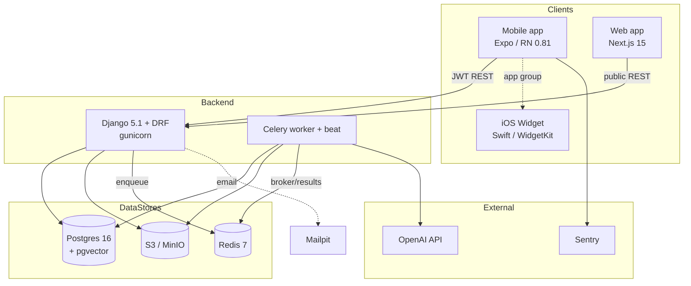

# Technology Stack Reference

> The canonical "what are we using" catalogue for the RIVR Health AI monorepo. This document lists **every** technology, framework, library, and external service across the backend, mobile app, web app, native (iOS/Android + Swift widget), and external services — with version constraint, where it's used, and why.
>
> This is a reference, not a tutorial. For *how* the pieces fit together, see the linked docs:
> - [Documentation Index & System Overview](./README.md)
> - [Architecture Overview](./architecture-overview.md)
> - [Backend Services (Django / DRF / Celery)](./backend-services.md)
> - [AI Document Ingestion Pipeline & RAG Q&A](./ai-ingestion-and-qa.md)
> - [Mobile App (Expo / React Native)](./mobile-app.md)
> - [Web App (Next.js)](./web-app.md)
> - [Data Model & End-to-End Flows](./data-model-and-flows.md)
> - [Build, Deploy & Infrastructure](./build-deploy-infra.md)

---

## Table of contents

- [1. Top-level layout](#1-top-level-layout)
- [2. System tiers at a glance](#2-system-tiers-at-a-glance)
- [3. Backend — Python runtime & frameworks](#3-backend--python-runtime--frameworks)
- [4. Backend — data stores & storage](#4-backend--data-stores--storage)
- [5. Backend — AI / ML stack](#5-backend--ai--ml-stack)
- [6. Backend — supporting libraries](#6-backend--supporting-libraries)
- [7. Backend — dev/test dependencies](#7-backend--devtest-dependencies)
- [8. AI model & embedding configuration](#8-ai-model--embedding-configuration)
- [9. Infrastructure services (Docker Compose)](#9-infrastructure-services-docker-compose)
- [10. Mobile app — Expo / React Native stack](#10-mobile-app--expo--react-native-stack)
- [11. Mobile app — Expo SDK modules](#11-mobile-app--expo-sdk-modules)
- [12. Mobile app — native integrations & UI libraries](#12-mobile-app--native-integrations--ui-libraries)
- [13. Mobile app — dev dependencies & tooling](#13-mobile-app--dev-dependencies--tooling)
- [14. Native (iOS / Android / Swift widget)](#14-native-ios--android--swift-widget)
- [15. Web app — Next.js stack](#15-web-app--nextjs-stack)
- [16. External services](#16-external-services)
- [17. Build & deploy tooling](#17-build--deploy-tooling)
- [18. Cross-cutting constants & shared identifiers](#18-cross-cutting-constants--shared-identifiers)
- [19. Version-pinning philosophy & known gotchas](#19-version-pinning-philosophy--known-gotchas)

---

## 1. Top-level layout

The repo (`/Users/darwashi/Downloads/rivr/RIVR-Health-AI`) is a monorepo containing **four distinct codebases**, each with its own dependency tree:

```
RIVR-Health-AI/
├── backend/          Django 5.1 + DRF + Celery API & AI worker (Python, requirements.txt)
├── src/              Expo / React Native mobile app source (TypeScript, root package.json)
├── web/              Next.js 15 companion web app (TypeScript, web/package.json)
├── ios/              Generated iOS native project (Swift / Objective-C, CocoaPods)
├── android/          Generated Android native project (Kotlin / Gradle)
├── targets/widget/   Apple WidgetKit "Emergency Card" target (Swift)
├── plugins/          Local Expo config plugins (Node)
├── scripts/          Dev/fixture helper scripts (Node)
├── app.json          Expo app config
├── eas.json          EAS build/submit profiles
├── package.json      Root Expo app manifest
└── dev               Local-dev launcher (bash)
```

There are **two separate JS dependency trees** — root (Expo/RN) and `web/` (Next.js) — each with its own `node_modules`, lockfile, `tsconfig.json`, and lint posture. The backend is an independent Python tree.

---

## 2. System tiers at a glance

| Tier | Primary language | Core framework | Manifest |
|---|---|---|---|
| Backend API + AI worker | Python 3.12 | Django 5.1 / DRF / Celery | `backend/requirements.txt` |
| Mobile app | TypeScript | Expo SDK 54 / React Native 0.81 | `package.json` (root) |
| Web app | TypeScript | Next.js 15 (App Router) / React 19 | `web/package.json` |
| Native iOS | Swift / Obj-C | UIKit + WidgetKit + HealthKit | `ios/`, `targets/widget/` |
| Native Android | Kotlin / Java | React Native + Expo | `android/` |
| External services | — | OpenAI, Sentry, EAS, S3/MinIO | env vars |



---

## 3. Backend — Python runtime & frameworks

**Runtime:** CPython **3.12** (`python:3.12-slim` base image, `backend/Dockerfile:1`). The project package is `config/` (`config/settings/base.py`, `config/urls.py`, `config/celery.py`); local apps live under `apps/`.

| Library | Constraint (`backend/requirements.txt`) | Where used | Why |
|---|---|---|---|
| **Django** | `>=5.1,<5.2` | Whole backend; project at `backend/config/` | Web framework, ORM, migrations, admin, auth scaffolding. `AUTH_USER_MODEL = "accounts.User"`. |
| **djangorestframework** (DRF) | `>=3.15,<3.16` | All `apps/*/views.py`, `serializers.py` | REST API layer: viewsets, serializers, pagination (`LimitOffsetPagination`, `PAGE_SIZE=30`), throttling (`ScopedRateThrottle`, `share_resolve: 30/min`), filtering. |
| **djangorestframework-simplejwt** | `>=5.3,<6` | `apps/accounts/` (login/refresh/logout) | JWT auth. `ACCESS_TOKEN_LIFETIME=30 min`, `REFRESH_TOKEN_LIFETIME=30 days`, `ROTATE_REFRESH_TOKENS=True`, `BLACKLIST_AFTER_ROTATION=True`. Token-blacklist app (`rest_framework_simplejwt.token_blacklist`) installed for logout/rotation. |
| **django-environ** | `>=0.11,<0.12` | `backend/config/settings/base.py` | 12-factor config: reads `backend/.env` via `environ.Env.read_env`, parses `DATABASE_URL`, typed env getters (`env.bool`, `env.int`, `env.db`, `env.list`). |
| **django-cors-headers** | `>=4.6,<5` | `MIDDLEWARE` (first entry) | CORS handling. `CORS_ALLOW_ALL_ORIGINS` defaults **True** (gotcha — see §19). |
| **django-filter** | `>=24.3` | `apps/*/filters.py`, DRF `DEFAULT_FILTER_BACKENDS` | Declarative querystring filtering (`DocumentFilter`, `TimelineEventFilter`, `AiJobFilter`). |
| **drf-spectacular** | `>=0.28,<0.29` | `config/urls.py` (`/api/schema/`, `/api/docs/`) | OpenAPI 3 schema generation + Swagger UI. `DEFAULT_SCHEMA_CLASS = drf_spectacular.openapi.AutoSchema`. Schema TITLE "RIVR API", VERSION "0.1.0". |
| **celery** | `>=5.4,<6` | `config/celery.py`, `apps/jobs/tasks.py` | Async task queue + beat scheduler for the AI ingestion/evaluation pipeline. App name `"rivr"`. |
| **gunicorn** | `>=23,<24` | `Dockerfile` `CMD` | WSGI server in the container (`gunicorn config.wsgi:application --bind 0.0.0.0:8000`). Note: Compose `web` overrides this with `runserver`; gunicorn is the image default. |
| **whitenoise** | `>=6.8,<7` | `MIDDLEWARE` (after security) | Static-file serving without a separate web server. `STATIC_ROOT=BASE_DIR/staticfiles`. Stripped from middleware in tests. |

Routing entry points all default `DJANGO_SETTINGS_MODULE = "config.settings.dev"` (`manage.py`, `config/wsgi.py`, `config/asgi.py`, `config/celery.py`). See [Backend Services](./backend-services.md) for the full request lifecycle and [Build & Deploy](./build-deploy-infra.md) for the **no-prod-settings** gotcha.

---

## 4. Backend — data stores & storage

| Library | Constraint | Where used | Why |
|---|---|---|---|
| **psycopg[binary]** | `>=3.2,<4` | DB driver | Postgres 3.x binary driver. Engine resolved by `django-environ` from `DATABASE_URL` → `django.db.backends.postgresql`. |
| **pgvector** | `>=0.3,<0.4` | `apps/jobs/models.py`, `apps/jobs/index.py`, migrations | Vector storage + ANN search. Provides `VectorField`, `HnswIndex`, `CosineDistance`, `VectorExtension`. |
| **redis** (py client) | `>=5.2,<6` | Celery broker/result transport | Python client used by Celery for `CELERY_BROKER_URL` (`redis://…/0`) and `CELERY_RESULT_BACKEND` (`redis://…/1`). |
| **django-storages** | `>=1.14,<2` | `apps/common/storage.py`, `STORAGES["default"]` | S3/MinIO backend (`storages.backends.s3.S3Storage`) — activated only when `AWS_ACCESS_KEY_ID` is set; else `FileSystemStorage`. |
| **boto3** | `>=1.35,<2` | Transitive dep of django-storages | AWS SDK powering the S3 storage backend / presigned URLs. |

**Database:** Postgres 16 with the pgvector extension (image `pgvector/pgvector:pg16`). The `vector` extension is installed by migration `backend/apps/jobs/migrations/0003_vector_extension.py` (`pgvector.django.VectorExtension()`). Tests run against **real Postgres** (not SQLite) because `ArrayField` and pgvector are Postgres-only (`backend/config/settings/test.py`).

**Vector index:** `Embedding.vector = VectorField(dimensions=768)` (`db_table="embeddings"`) with HNSW index `emb_vec_hnsw` (`m=16`, `ef_construction=64`, opclass `vector_cosine_ops`).

**Object storage key layout** (single bucket, domain-prefixed — `apps/common/storage.py`):

```
documents/{user_id}/{kind}/{uuid}_{name}              # uploaded blobs (kind = voice-notes | medical-images | medical-documents)
documents/{user_id}/processed/{doc_id}/summary.json   # per-doc extracted facts
documents/{user_id}/ai/evaluation/latest.json         # latest health evaluation
avatars/{user_id}/avatar.jpg                           # profile avatar (512×512 JPEG)
share-artifacts/{uuid}/{type}.pdf                      # share PDFs
```

S3/MinIO flags (when active): `AWS_S3_ADDRESSING_STYLE="path"`, `AWS_QUERYSTRING_AUTH=True`, `AWS_QUERYSTRING_EXPIRE=600` (10-min signed URLs), `AWS_DEFAULT_ACL=None`, `AWS_S3_FILE_OVERWRITE=False`.

See [Data Model & Flows](./data-model-and-flows.md) for the full model/table inventory.

---

## 5. Backend — AI / ML stack

| Library | Constraint | Where used | Why |
|---|---|---|---|
| **openai** | `>=1.50,<2` | `apps/jobs/ai_client.py`, `apps/jobs/embeddings.py` | OpenAI Python SDK. Uses the **Responses API** (`client.responses.parse` with pydantic `text_format` for structured output; `client.responses.create` for vision OCR), `client.embeddings.create`, and `client.audio.transcriptions.create`. Client built with `max_retries=4`. |
| **pydantic** | `>=2.9,<3` | `apps/jobs/schemas.py` | Pydantic v2 structured-output schemas (parity with the legacy TS Zod schemas): `DocumentFacts`, `KeyFacts`, `HealthEvaluation`, `ThreeByFiveCard`, `QAAnswer`, `TimelineEvent`, etc. These models are the `text_format` passed to the Responses API. |
| **PyMuPDF** (`fitz`) | `>=1.24,<2` | `apps/jobs/extraction.py` | PDF text + raster-image extraction, full-page PNG rendering, CMYK→RGB conversion. `fitz.open(stream=…, filetype="pdf")`. |
| **Pillow** (`PIL`) | `>=11,<12` | `apps/common/storage.py` (`process_avatar`) | Image processing — avatar center-crop/resize to 512×512 JPEG (q85), strips EXIF by re-encoding. |
| **reportlab** | `>=4,<5` | `apps/shares/pdf.py` | Share-link PDF generation (lazy-imported `canvas`). Direct `drawString` rendering (no Platypus). |

The AI stack is a faithful Python port of a former Node.js worker (`worker/src/*.ts`); prompts are copied **verbatim**. See [AI Ingestion & Q&A](./ai-ingestion-and-qa.md) for the full pipeline, prompt structure, and RAG retrieval flow.

---

## 6. Backend — supporting libraries

These appear in `requirements.txt` above but are summarized here by responsibility for quick lookup:

| Concern | Library |
|---|---|
| PDF **ingestion** (read) | PyMuPDF |
| PDF **generation** (write, shares) | reportlab |
| Image processing | Pillow |
| Structured LLM output validation | pydantic v2 |
| Vector search | pgvector |
| Object storage | django-storages + boto3 |
| OpenAPI docs | drf-spectacular |
| Querystring filtering | django-filter |
| CORS | django-cors-headers |
| JWT auth | djangorestframework-simplejwt |
| Static files | whitenoise |

---

## 7. Backend — dev/test dependencies

`backend/requirements-dev.txt` pulls in `-r requirements.txt` plus:

| Library | Constraint | Why |
|---|---|---|
| **pytest** | `>=8.3,<9` | Test runner. |
| **pytest-django** | `>=4.9,<5` | Django integration for pytest. `DJANGO_SETTINGS_MODULE = config.settings.test` (`pytest.ini`). |
| **pytest-cov** | `>=6,<7` | Coverage reporting. |
| **factory-boy** | `>=3.3,<4` | Test fixtures / model factories. |

**Gotcha:** the `Dockerfile` installs `requirements-dev.txt` (line 14) into the **runtime image**, so pytest and friends ship in production containers.

Test suite (`backend/tests/`): `test_auth`, `test_api`, `test_pipeline`, `test_qa`, `test_index`, `test_embeddings`, `test_extraction`, `test_storage`, `test_jobs_enqueue`, `test_models`, `test_pdf_ingestion`, `test_profile_logic`, `test_shares`, `test_smoke`. Test settings (`config/settings/test.py`): eager Celery, MD5 password hasher, `locmem` email, `InMemoryStorage`, no whitenoise, `share_resolve` throttle raised to `1000/min`.

---

## 8. AI model & embedding configuration

All AI model selection is **env-driven** (`backend/config/settings/base.py:182-199`, confirmed verbatim). Defaults below:

| Setting | Default value | Used by | Purpose |
|---|---|---|---|
| `OPENAI_API_KEY` | `""` | All AI calls; gates `QAView` (503 if empty) | OpenAI auth. |
| `OPENAI_BASE_URL` | `https://api.openai.com/v1` | OpenAI client | API base (overridable for proxies). |
| `AI_MODEL_EXTRACT` | `gpt-4o-2024-08-06` | `extract_document_facts_chunked` | Document fact extraction (structured). |
| `AI_MODEL_EVAL` | `gpt-4o-2024-08-06` | `evaluate_user_health`; Q&A fallback | Health evaluation + Q&A fallback model. |
| `AI_MODEL_OCR` | `gpt-4o-mini` | `ocr_images` | Vision OCR of scanned/image pages. |
| `AI_MODEL_TRANSCRIBE` | `whisper-1` | `transcribe_audio` | Voice-note transcription (25 MB limit). |
| `AI_MODEL_QUESTION_ANSWER` | `""` (→ falls back to `AI_MODEL_EVAL`) | `answer_health_question` | RAG Q&A model. |
| `EMBEDDING_BASE_URL` | = `OPENAI_BASE_URL` | `embeddings.embed` | Embedding endpoint (can point at a self-hosted/Nomic endpoint). |
| `EMBEDDING_API_KEY` | = `OPENAI_API_KEY` | `embeddings.embed` | Embedding auth. |
| `EMBEDDING_MODEL` | `nomic-embed-text-v1.5` | `embeddings.embed` | 768-dim embedding model; uses `search_query:` / `search_document:` task prefixes. |
| `EMBEDDING_DIM` | `768` | settings only | Embedding dimension. **Decoupled** from the hardcoded `768` in `apps/jobs/embeddings.py` and the `VectorField(dimensions=768)` column (see §19). |
| `OCR_MIN_IMAGE_PX` | `100` | `extraction.extract_pdf` | Skip logos/icons below this size. |
| `OCR_BATCH_SIZE` | `10` | `ai_client.ocr_images` | Images per OCR batch. |

> The defaults are OpenAI (`gpt-4o`/`whisper-1`) for generation, but the embedding default (`nomic-embed-text-v1.5`, 768-dim, with separate `EMBEDDING_BASE_URL`/`EMBEDDING_API_KEY`) signals embeddings are intended to run against an **OpenAI-compatible alternate endpoint** (Nomic). The wrapper code calls everything through the OpenAI SDK shape regardless.

---

## 9. Infrastructure services (Docker Compose)

Local stack from `backend/docker-compose.yml` (Compose project `name: rivr-backend`):

| Service | Image | Ports (host:container) | Role |
|---|---|---|---|
| **db** | `pgvector/pgvector:pg16` | `5433:5432` | Postgres 16 + pgvector. User/pass/db = `rivr`. Volume `pgdata`. Healthcheck `pg_isready -U rivr`. |
| **redis** | `redis:7` | `6379:6379` | Celery broker (DB 0) + result backend (DB 1). |
| **minio** | `minio/minio` | `9000:9000` (API), `9001:9001` (console) | S3-compatible object storage. Root `rivr-minio` / `rivr-minio-secret`. Volume `miniodata`. |
| **createbuckets** | `minio/mc` | — (one-shot) | Creates the private `rivr-media` bucket, then exits. |
| **mailpit** | `axllent/mailpit` | `1025:1025` (SMTP), `8025:8025` (UI) | Local SMTP sink + web inbox for verification/reset emails. |
| **web** | `build: .` | `8000:8000` | Django dev server (`migrate && runserver`). Bind-mounts `./:/app`. |
| **worker** | `build: .` | — | `celery -A config worker -l info`. |
| **beat** | `build: .` | — | `celery -A config beat -l info`. Runs `recover-stale-jobs` every 300 s. |

**Container base:** `python:3.12-slim` with apt `build-essential` + `libpq-dev` (`backend/Dockerfile`).

**Coexistence override:** `backend/docker-compose.local.yml` (gitignored) remaps `web` to `8001:8000` and makes Redis internal-only — used when sharing a host that already occupies `:8000`/`:6379`. The mobile client's `.env` points at `http://localhost:8001` accordingly. See [Build & Deploy](./build-deploy-infra.md) and the `./dev` launcher.

---

## 10. Mobile app — Expo / React Native stack

Root `package.json` (`name: rivr-health-ai`, `version 1.0.0`). Expo-managed, TypeScript, **New Architecture disabled** (`newArchEnabled: false`).

| Library | Version | Where used | Why |
|---|---|---|---|
| **expo** | `~54.0.34` | App runtime | Expo SDK 54 — managed RN tooling, config plugins, dev client. |
| **react-native** | `0.81.5` | App runtime | RN core. |
| **react** | `19.1.0` | App runtime | React core (RN renderer). |
| **react-dom** | `19.1.0` | `react-native-web` target | DOM renderer for web build. |
| **react-native-web** | `^0.21.0` | Web export of the Expo app | Renders RN components on web (separate from the `web/` Next.js app). |
| **typescript** | `~5.9.2` (devDep) | Whole app | Static typing. |

**Navigation:**

| Library | Version | Why |
|---|---|---|
| **@react-navigation/native** | `^7.1.26` | Navigation container, theming, deep linking (`rivrhealth://`). |
| **@react-navigation/native-stack** | `^7.9.0` | Three native stacks (`AuthNavigator`, `OnboardingNavigator`, `AppNavigator`) swapped at the `App.tsx` level by session/onboarding state. |
| **react-native-screens** | `~4.16.0` | Native screen primitives backing the stacks. |
| **react-native-safe-area-context** | `~5.6.0` | Safe-area insets. |

See [Mobile App](./mobile-app.md) for the provider tree, navigation structure, contexts, and the API client.

---

## 11. Mobile app — Expo SDK modules

| Module | Version | Where used | Why |
|---|---|---|---|
| **expo-image-picker** | `~17.0.11` | Document scan, avatar | Camera/library capture (scan pages, avatar, gallery images). |
| **expo-document-picker** | `~14.0.8` | `UploadFile.tsx` | Picking PDFs to upload. |
| **expo-print** | `~15.0.8` | Native scan→PDF compile | `printToFileAsync({html})` to assemble scanned images into a PDF (native path). |
| **expo-image-manipulator** | `~14.0.8` | Scan pipeline | Resize/compress scanned images (≤1800 px, JPEG q0.82). |
| **expo-file-system** | `~19.0.22` | Scan pipeline | Reads page base64 (legacy API) for the HTML→PDF step. |
| **expo-av** | `~16.0.8` | `RecordVoiceNote.tsx` | Audio recording for voice notes. |
| **expo-clipboard** | `~8.0.8` | `ShareScreen.tsx` | Copy share URL to clipboard. |
| **expo-linear-gradient** | `~15.0.8` | `SplashScreen.tsx` | Brand gradient splash. |
| **expo-linking** | `~8.0.12` | Deep-link handling | URL open / scheme handling. |
| **expo-font** | `~14.0.11` | Config plugin | Font loading. |
| **expo-status-bar** | `~3.0.8` | App chrome | Status-bar styling. |
| **expo-build-properties** | `~1.0.10` | `app.json` plugin | Sets iOS `deploymentTarget = 15.1`. |
| **expo-dev-client** | `~6.0.21` | Development builds | Custom dev client (EAS `development` profile). |

---

## 12. Mobile app — native integrations & UI libraries

| Library | Version | Where used | Why |
|---|---|---|---|
| **react-native-health** | `^1.19.0` | `src/lib/health/healthkit.ios.ts` | HealthKit bridge (`AppleHealthKit`). **Read-only** scopes (heart rate, sleep, steps, distance, active energy, HRV, weight, blood pressure). iOS only. |
| **@bacons/apple-targets** | `4.0.7` | `targets/widget/`, `src/lib/emergencyCardWidget/sync.ts` | Builds the Apple WidgetKit target; provides `ExtensionStorage` to write the App Group payload and `reloadWidget("RivrWidget")`. |
| **@react-native-async-storage/async-storage** | `2.2.0` | API client, theme, welcome flag | Local key/value store (JWT tokens `rivr.access`/`rivr.refresh`, `rivr_theme_preference`, `rivr_welcome_seen`, widget dismiss flag). |
| **@react-native-community/netinfo** | `11.4.1` | `NetworkContext.tsx` | Connectivity boolean (UI signal only; no request queue). |
| **@sentry/react-native** | `~7.2.0` | `src/lib/sentry.ts`, `App.tsx` | Error/perf monitoring. `Sentry.wrap(App)`. Disabled in `__DEV__`. |
| **react-native-svg** | `15.12.1` | Apple Health charts, score ring | SVG primitives (`MiniBarChart`, `MiniLineChart`, `ScoreRing`). |
| **react-native-qrcode-svg** | `^6.3.21` | `ShareScreen.tsx` | Renders the share-link QR code. |
| **@cantoo/pdf-lib** | `^2.6.1` | `src/lib/scanPdf.web.ts` | **Web** scan→PDF compile (`embedJpg`). Native uses `expo-print` instead. |
| **@expo/vector-icons** | `^15.0.3` | Throughout UI | Ionicons etc. |
| **base64-arraybuffer** | `^1.0.2` | Scan/image encoding | Base64 ↔ ArrayBuffer conversion. |
| **country-flag-icons** | `^1.6.15` | Phone field | Country flags. |
| **fast-xml-parser** | `^5.3.6` | Apple Health export parsing | XML parsing (Apple Health export utilities). |
| **react-native-document-picker** | `^9.3.1` | Document picking | Native document picker (excluded from `reactNativeDirectoryCheck`). |

> **Dual scan→PDF strategy:** Metro resolves `src/lib/scanPdf.web.ts` (`@cantoo/pdf-lib`) on web and the native stub (which throws) elsewhere; native compiles via `expo-print` HTML→PDF. See [Mobile App](./mobile-app.md).

---

## 13. Mobile app — dev dependencies & tooling

| Tool | Version | Why |
|---|---|---|
| **vitest** | `^4.1.6` | Unit test runner (`npm test` = `vitest run`). Tests: `client.test.ts`, `linking.test.ts`, `documentScanFlow.test.ts`, `documentProcessingUi.test.ts`. |
| **eslint** | `^9.0.0` | Linting. |
| **eslint-config-expo** | `~10.0.0` | Expo flat ESLint config (`eslint.config.js` → `eslint-config-expo/flat`). |
| **typescript** | `~5.9.2` | Type checking (`tsc --noEmit --pretty false`). |
| **@types/react** | `~19.1.0` | React type defs. |

**Overrides** (`package.json`): `@expo/config-plugins` pinned to `54.0.4`; `postcss ^8.5.10` forced under `@expo/metro-config`. `expo.doctor.reactNativeDirectoryCheck.exclude`: `react-native-health`, `react-native-document-picker`.

---

## 14. Native (iOS / Android / Swift widget)

### iOS

| Item | Value / tech | Source |
|---|---|---|
| Bundle identifier | `com.rivrhealth.app` | `app.json`, `ios/` |
| Apple Team ID | `NUGFXB4PHG` | `app.json`, `eas.json` |
| Deployment target | iOS **15.1** (app) / 15.1 (widget) | `expo-build-properties`, widget config |
| Minimum system | `LSMinimumSystemVersion 12.0` | `ios/RIVRHealthAI/Info.plist` |
| New Architecture | disabled (`RCTNewArchEnabled false`) | `Info.plist` |
| URL schemes | `rivrhealth`, `com.rivrhealth.app`, `exp+rivr-health-ai` | `Info.plist` |
| HealthKit entitlement | `com.apple.developer.healthkit: true` (read access) | `RIVRHealthAI.entitlements` |
| App Group | `group.com.rivrhealth.app` | entitlements (app + widget) |
| Dependency manager | **CocoaPods** | `ios/Podfile` |

**`plugins/with-ios-fmt-xcode-fix.js`** — a `withDangerousMod` Expo config plugin that patches the generated `ios/Podfile` to set `#define FMT_USE_CONSTEVAL 0`, working around **fmt 11.0.2 `consteval` failures on Apple clang**. Without it, native iOS builds fail to compile.

### Apple widget (`targets/widget/`)

| Tech | Detail |
|---|---|
| Framework | **WidgetKit** (Swift) |
| Generator | `@bacons/apple-targets` 4.0.7 |
| Widget kind | `RivrWidget` ("Emergency Card") |
| Storage | `UserDefaults(suiteName: "group.com.rivrhealth.app")`, key `emergency_card` |
| Deep link | `rivrhealth://health-summary` |
| Timeline policy | `.never` (event-driven; refreshed only via `reloadWidget`) |
| Families | `.systemSmall` / `.systemMedium` / `.systemLarge` |
| Files | `EmergencyCardWidget.swift`, `EmergencyCardViews.swift`, `expo-target.config.js`, `Info.plist`, `generated.entitlements`, `Assets.xcassets` |

The Swift `EmergencyCard` Codable mirrors the RN `EmergencyCardWidgetPayload` (`src/lib/emergencyCardWidget/mapping.ts`). Both sides hardcode `group.com.rivrhealth.app` / `emergency_card` / `RivrWidget` — changing one without the other silently breaks the widget.

### Android

| Item | Value / tech | Source |
|---|---|---|
| Package / applicationId | `com.rivrhealth.app` | `android/app/build.gradle`, `app.json` |
| versionCode / versionName | `1` / `1.0.0` | `android/app/build.gradle` |
| JS engine | JSC (`io.github.react-native-community:jsc-android`) | `build.gradle` |
| Build system | **Gradle** + Expo root project | `android/build.gradle` |
| Permissions | `INTERNET`, `RECORD_AUDIO`, `MODIFY_AUDIO_SETTINGS`, `READ/WRITE_EXTERNAL_STORAGE`, `SYSTEM_ALERT_WINDOW`, `VIBRATE` | `AndroidManifest.xml` |
| Deep-link schemes | `rivrhealth`, `exp+rivr-health-ai` | `AndroidManifest.xml` |
| expo-updates | disabled (`expo.modules.updates.ENABLED=false`) | `AndroidManifest.xml` |

**Gotcha:** release builds reuse the **debug keystore** (`signingConfig signingConfigs.debug` in the `release` block) — flagged in-file as not production-safe. Debug manifests force `usesCleartextTraffic="true"` for the plain-HTTP dev server.

See [Build & Deploy](./build-deploy-infra.md) for the full native config and prebuild details.

---

## 15. Web app — Next.js stack

`web/package.json` (`name: rivr-web`, `version 0.1.0`) — a small, **unauthenticated** companion app hosting three web-only flows: password reset, email verification, and the public share viewer.

| Library | Version | Where used | Why |
|---|---|---|---|
| **next** | `^15.5.19` | Whole app (App Router) | React framework. `reactStrictMode: true`, `outputFileTracingRoot: __dirname` (pins tracing to `web/`). |
| **react** | `19.0.0` | UI | React core. |
| **react-dom** | `19.0.0` | UI | DOM renderer. |

**Dev dependencies:**

| Library | Version | Why |
|---|---|---|
| **typescript** | `5.7.3` | Type checking (`tsc --noEmit`). Strict, `target ES2022`, `moduleResolution bundler`, path alias `@/* → ./*`. |
| **tailwindcss** | `3.4.17` | Styling. Custom theme: `teal #1FADA6`/`soft #E6FAF8`, `ink #0D1B2A`, `sub #3D526B`, `muted #64748B` (reused in the native widget colorset). |
| **autoprefixer** | `10.4.20` | PostCSS plugin. |
| **postcss** | `8.5.1` | CSS pipeline. |
| **@types/node** | `22.10.7` | Node type defs. |
| **@types/react** | `19.0.7` | React type defs. |
| **@types/react-dom** | `19.0.3` | React DOM type defs. |

**Routes** (`web/app/`): `/` (index), `/reset-password` and `/verify-email` (route group `(auth)`, path-transparent), `/share`. Backend endpoints called (via `web/lib/api.ts`, base `NEXT_PUBLIC_API_URL`): `POST /api/auth/password/reset`, `POST /api/auth/verify-email`, `POST /api/shares/resolve`. After reset/verify the page offers the deep link `rivrhealth://auth/confirmed`.

> The `web/` app is an **independent package** from the root Expo app — separate `node_modules`, lockfile, `tsconfig`, and lint (`next lint` vs the root `eslint-config-expo`). See [Web App](./web-app.md).

---

## 16. External services

| Service | SDK / client | Config / identifier | Used by | Purpose |
|---|---|---|---|---|
| **OpenAI** | `openai` Python SDK `>=1.50,<2` | `OPENAI_API_KEY`, `OPENAI_BASE_URL`, model env vars (§8) | Backend AI worker (`apps/jobs/ai_client.py`, `embeddings.py`) | Fact extraction, health evaluation, vision OCR, audio transcription, RAG Q&A, embeddings. |
| **Nomic (or OpenAI-compatible embeddings endpoint)** | OpenAI SDK shape | `EMBEDDING_MODEL=nomic-embed-text-v1.5`, `EMBEDDING_BASE_URL`, `EMBEDDING_API_KEY` | `apps/jobs/embeddings.py` | 768-dim text embeddings with `search_query:`/`search_document:` prefixes. |
| **Sentry** | `@sentry/react-native` `~7.2.0` | `EXPO_PUBLIC_SENTRY_DSN` | Mobile app (`src/lib/sentry.ts`) | Crash/error + perf monitoring (`tracesSampleRate 0.2`). Init only if DSN set; disabled in `__DEV__`. |
| **Object storage (S3 / MinIO)** | django-storages + boto3 | `AWS_ACCESS_KEY_ID`, `AWS_SECRET_ACCESS_KEY`, `AWS_STORAGE_BUCKET_NAME` (`rivr-media`), `AWS_S3_ENDPOINT_URL`, `AWS_S3_REGION_NAME` (`us-east-1`) | Backend (`apps/common/storage.py`) | Document blobs, processed summaries, evaluation JSON, avatars, share PDFs. |
| **Expo Application Services (EAS)** | EAS CLI `>= 3.0.0` | `extra.eas.projectId = 0b17b39a-c1e6-49f9-95e3-71acea501e8f`, `owner darwashiom` | Mobile builds/submits (`eas.json`) | Cloud build + App Store submit. |
| **Apple App Store Connect** | EAS submit | `appleId darwashi@udel.edu`, `ascAppId 6761561666`, `appleTeamId NUGFXB4PHG` | iOS submit (`eas.json`) | Production iOS distribution. |
| **Email (SMTP / Mailpit locally)** | Django `send_mail` | `EMAIL_HOST`, `EMAIL_PORT=1025`, `DEFAULT_FROM_EMAIL` | `apps/accounts/emails.py` | Verification + password-reset emails (plain text). Local sink: Mailpit. |
| **Vercel** | — (CI/hosting) | `VERCEL_OIDC_TOKEN` in `.env.local`, `EXPO_PUBLIC_RESET_REDIRECT_TO=https://reset-web-liart.vercel.app` | Web reset flow / deployment | Hosts/redirects the web reset flow (project `rivr-health-ai`, team `rivr-shares-projects`). |

> **Legacy:** `scripts/empty-share-artifacts.mjs` references `@supabase/supabase-js` (`SUPABASE_URL`, `SUPABASE_SERVICE_ROLE_KEY`) — a leftover diagnostic from the pre-Django **Supabase** era (the backend migrated Supabase→Django). It is not part of the live runtime.

---

## 17. Build & deploy tooling

| Tool | Where | Role |
|---|---|---|
| **Docker / Docker Compose** | `backend/Dockerfile`, `docker-compose.yml`, `docker-compose.local.yml` | Backend container + local infra stack. |
| **gunicorn** | `Dockerfile` `CMD` | Production WSGI server. |
| **EAS CLI** (`eas.json`) | Mobile | Build profiles `development` (dev client, simulator), `preview` (internal), `production` (autoIncrement, `appVersionSource: "remote"`); submit to App Store. |
| **CocoaPods** | `ios/Podfile` | iOS native deps (with fmt patch + apple-targets loader). |
| **Gradle** | `android/` | Android native build. |
| **Metro** | Expo | RN bundler (platform-split resolution for `scanPdf.web.ts`). |
| **`./dev`** (bash) | repo root | One-command local stack: backend (Docker, detached) + web (Next.js, background) + mobile (Expo, foreground). Discovers the API host port dynamically, bootstraps env files, waits on `/api/schema/`. |
| **Helper scripts** | `scripts/` | `build-health-summary.cjs` (Apple Health export → summary fixture, Node `readline` regex parser); `empty-share-artifacts.mjs` (legacy Supabase diagnostic). |

See [Build & Deploy](./build-deploy-infra.md) for the full `./dev` mechanics, Compose layering, and EAS/native config.

---

## 18. Cross-cutting constants & shared identifiers

These constants are duplicated across tiers; changing one side without the others silently breaks integration.

| Identifier | Value | Appears in |
|---|---|---|
| Deep-link scheme | `rivrhealth://` | `app.json`, iOS `Info.plist`, AndroidManifest, `src/navigation/linking.ts`, `web/` CTA |
| App Group | `group.com.rivrhealth.app` | iOS/widget entitlements, `src/lib/emergencyCardWidget/sync.ts`, Swift widget |
| Widget App-Group key | `emergency_card` | `sync.ts`, `EmergencyCardWidget.swift` |
| Widget kind | `RivrWidget` | `sync.ts`, `EmergencyCardWidget.swift`, `expo-target.config.js` |
| Bundle id / package | `com.rivrhealth.app` | iOS, Android, URL scheme |
| Apple Team ID | `NUGFXB4PHG` | `app.json`, `eas.json`, iOS |
| EAS project id | `0b17b39a-c1e6-49f9-95e3-71acea501e8f` | `app.json` |
| Embedding dimension | `768` | `EMBEDDING_DIM` env, `embeddings.py` constant, `VectorField(dimensions=768)` |
| Brand teal | `#1FADA6` | mobile tokens, web Tailwind, widget colorset |
| JWT storage keys | `rivr.access` / `rivr.refresh` | `src/lib/api/client.ts` |

**Env var prefixes:** `EXPO_PUBLIC_*` (mobile, inlined into the bundle — **public, not secret**), `NEXT_PUBLIC_*` (web), `DJANGO_*` / `AWS_*` / `AI_MODEL_*` / `EMBEDDING_*` (backend). Key client vars: `EXPO_PUBLIC_API_URL` (mobile API base, `http://localhost:8001` locally), `NEXT_PUBLIC_API_URL` (web API base), `EXPO_PUBLIC_SENTRY_DSN`, `EXPO_PUBLIC_RESET_REDIRECT_TO`.

---

## 19. Version-pinning philosophy & known gotchas

**Pinning philosophy:**
- **Backend (Python):** range constraints (`>=X,<Y`) pinning the major/minor floor and the next breaking ceiling (e.g. `Django>=5.1,<5.2`). Conservative — allows patch updates, blocks majors.
- **Mobile (Expo):** Expo-managed `~`/exact pins so each package matches Expo SDK 54's expected versions; native modules (`react-native-health`, `@bacons/apple-targets`) use caret/exact pins.
- **Web (Next.js):** mostly exact pins on dev deps, caret on `next`/`react`.

**Known stack gotchas (cross-referenced from the detailed docs):**

1. **No prod settings module.** WSGI/gunicorn default to `config.settings.dev` (`DEBUG=True`, `CORS_ALLOW_ALL_ORIGINS` default-True) unless `DJANGO_SETTINGS_MODULE` is overridden. — [Build & Deploy](./build-deploy-infra.md)
2. **`EMBEDDING_DIM` is decoupled** from the hardcoded `768` in `apps/jobs/embeddings.py` and the `VectorField(dimensions=768)` column. Changing the env var alone won't migrate the DB; switching to a differently-sized embedding model requires a migration. — [AI Ingestion & Q&A](./ai-ingestion-and-qa.md)
3. **MinIO signed-URL caveat.** S3 URLs use the internal endpoint (`http://minio:9000`); with no custom-domain override they aren't reachable from a device/host.
4. **Dev deps in the runtime image.** The `Dockerfile` installs `requirements-dev.txt` (pytest etc.) into the production container.
5. **fmt consteval patch required.** Native iOS builds need `plugins/with-ios-fmt-xcode-fix.js` (`FMT_USE_CONSTEVAL 0`) or they fail to compile.
6. **Android release keystore = debug keystore.** Not production-safe (flagged in `build.gradle`).
7. **Sentry off in dev.** `@sentry/react-native` is disabled in `__DEV__` regardless of DSN.
8. **New Architecture disabled** across iOS, Android, and `app.json`.
9. **Two JS dependency trees.** Root (Expo) and `web/` (Next) are installed and versioned independently — note the React version skew (`19.1.0` mobile vs `19.0.0` web).
10. **Committed secrets.** `backend/.env` holds a real-looking `OPENAI_API_KEY`; `.env.local` holds a `VERCEL_OIDC_TOKEN`. Flagged for rotation. — [Build & Deploy](./build-deploy-infra.md)

For the architectural rationale behind these choices, see [Architecture Overview](./architecture-overview.md).
