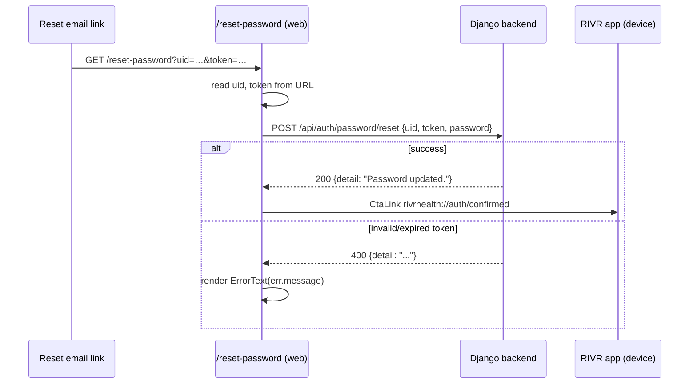
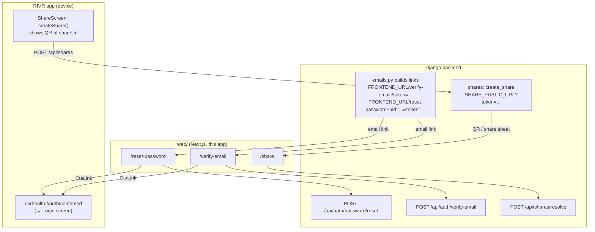

# Web App (Next.js)

> Part of the RIVR Health AI documentation set. See the [Documentation Index & System Overview](./README.md) for the full map, and the [Architecture Overview](./architecture-overview.md) for how the web app fits next to the [Mobile App](./mobile-app.md) and [Backend Services](./backend-services.md).

The `web/` package is a small, **public, unauthenticated** Next.js 15 companion to the Expo mobile app. It exists only to host three web-only flows that cannot live inside the native app because they are opened from email links or external browsers:

1. **Password reset** — `/reset-password?uid=…&token=…`
2. **Email verification** — `/verify-email?token=…`
3. **Public share viewer** — `/share?token=…` (view shared health PDFs with no account)

Plus a minimal marketing-style index at `/`. After completing reset/verify, each page offers a deep link back into the native app (`rivrhealth://auth/confirmed`).

It is a **completely separate package** from the root Expo app (`RIVR-Health-AI/package.json`): its own `package.json`, `node_modules`, lockfile, `tsconfig.json`, and lint posture. It shares nothing at the code level with the mobile app — the only seams are the **REST endpoints** it calls on the Django backend and the **`rivrhealth://` deep-link scheme** it hands back to the device.

---

## 1. Purpose & responsibilities

| Responsibility | Where | Notes |
|---|---|---|
| Password reset landing page | `web/app/(auth)/reset-password/page.tsx` | Consumes `uid`+`token` query params from a reset email; `POST /api/auth/password/reset` |
| Email verification landing page | `web/app/(auth)/verify-email/page.tsx` | Consumes `token` query param; `POST /api/auth/verify-email` on mount |
| Public share viewer | `web/app/share/page.tsx` | Consumes `token` (+ optional PIN); `POST /api/shares/resolve`; renders signed PDF links |
| Marketing index | `web/app/page.tsx` | Static logo + tagline, server component |
| Deep-link handoff to app | `CtaLink` → `rivrhealth://auth/confirmed` | Only works on a device with the app installed |

What the web app is **not**: it has no login form, no session, no token storage, no authenticated user state, and no access to the AI pipeline, profile, timeline, or document features. All of those live in the [Mobile App](./mobile-app.md). The web app is a thin presentation layer over four public/token-based backend endpoints.

---

## 2. Tech stack

From `web/package.json`:

| Package | Version | Role |
|---|---|---|
| `next` | `^15.5.19` | App Router framework (React Server Components + client components) |
| `react` / `react-dom` | `19.0.0` | React 19 |
| `typescript` | `5.7.3` | Strict TypeScript (`tsc --noEmit` typecheck) |
| `tailwindcss` | `3.4.17` | Utility CSS |
| `postcss` | `8.5.1` | CSS pipeline |
| `autoprefixer` | `10.4.20` | Vendor-prefix CSS |
| `@types/node` | `22.10.7` | Node types |
| `@types/react` / `@types/react-dom` | `19.0.7` / `19.0.3` | React 19 types |

Package metadata: `name: "rivr-web"`, `version: "0.1.0"`, `private: true`.

> This is intentionally a tiny dependency tree — no auth libraries, no state managers, no data-fetching libraries. The only runtime dependencies are Next + React. For the much larger mobile dependency set, see the [Technology Stack Reference](./tech-stack.md).

### Scripts (`web/package.json`)

| Script | Command | Purpose |
|---|---|---|
| `dev` | `next dev -p 3000` | Local dev server on port 3000 |
| `build` | `next build` | Production build |
| `start` | `next start -p 3000` | Serve the production build on port 3000 |
| `lint` | `next lint` | Next's built-in ESLint (no separate eslint config file in `web/`) |
| `typecheck` | `tsc --noEmit` | Type-check only |

> Port 3000 is significant: the backend's default `FRONTEND_URL` (`http://localhost:3000`) and `SHARE_PUBLIC_URL` (`http://localhost:3000/share`) point at exactly this dev server, so the email links and share URLs the backend generates resolve to these pages out of the box. See [§7](#7-relationship-to-the-backend-mobile-deep-link--share-flows).

---

## 3. App Router structure

The app uses the Next.js **App Router** (`web/app/`). File-system routing maps directly to URLs; a parenthesized directory like `(auth)` is a **route group** that is path-transparent (it does not contribute a segment to the URL).

```
web/
├── app/
│   ├── layout.tsx                     # Root layout (<html>, metadata, globals.css)
│   ├── globals.css                    # Tailwind directives + body base styles
│   ├── page.tsx                       # "/"  — marketing index (server component)
│   ├── (auth)/                        # route group — NOT in the URL path
│   │   ├── layout.tsx                 # shared centered card layout + Logo
│   │   ├── reset-password/
│   │   │   └── page.tsx               # "/reset-password"  (client)
│   │   └── verify-email/
│   │       └── page.tsx               # "/verify-email"    (client)
│   └── share/
│       └── page.tsx                   # "/share"           (client, public)
├── components/
│   └── ui.tsx                         # shared presentational primitives (client)
├── lib/
│   └── api.ts                         # tiny fetch wrapper (post + apiBase)
├── public/                            # /logo.png, /favicon.png
├── tailwind.config.ts
├── postcss.config.mjs
├── next.config.mjs
├── tsconfig.json
├── .env.local.example                 # NEXT_PUBLIC_API_URL only
└── package.json
```

### Route map

| URL | File | Rendering | Auth | Backend call |
|---|---|---|---|---|
| `/` | `web/app/page.tsx` | Server component | none | none |
| `/reset-password?uid=&token=` | `web/app/(auth)/reset-password/page.tsx` | Client (`"use client"`) | none (token in URL) | `POST /api/auth/password/reset` |
| `/verify-email?token=` | `web/app/(auth)/verify-email/page.tsx` | Client (`"use client"`) | none (token in URL) | `POST /api/auth/verify-email` |
| `/share?token=` | `web/app/share/page.tsx` | Client (`"use client"`) | none (public, throttled server-side) | `POST /api/shares/resolve` |

### Root layout — `web/app/layout.tsx`

- Exports `metadata`: title `"RIVR Health"`, description `"Your personal health record."`, icon `/favicon.png`.
- Imports `./globals.css` (the only place Tailwind is wired in).
- Renders `<html lang="en"><body>{children}</body></html>`.

### Index — `web/app/page.tsx`

A **server component** (no `"use client"`). Renders a centered `<Logo size={84}>` and the tagline `"Your health records, organized."`. Pure presentation, no data fetching.

---

## 4. The `(auth)` route group & the `share` route

### 4.1 `(auth)` group layout — `web/app/(auth)/layout.tsx`

A shared layout for the two auth helper pages. It centers a `max-w-sm` column and places a `<Logo size={64}>` above the page content (`{children}`). Because `(auth)` is path-transparent, the actual routes are **`/reset-password`** and **`/verify-email`** — there is no `/auth` prefix.

### 4.2 Password reset — `web/app/(auth)/reset-password/page.tsx`

`"use client"`. Structure:

- The default export `ResetPasswordPage` wraps the real component (`ResetForm`) in `<Suspense fallback={<Card>Loading…</Card>}>`. **This Suspense boundary is required** because `useSearchParams()` in Next 15 must be read inside a Suspense boundary (otherwise the build/render errors).
- `ResetForm` reads `uid` and `token` from `useSearchParams()` (default `""` each).
- One password `<Input type="password" required minLength={8}>` bound to local state.
- On submit: `await api.post("/api/auth/password/reset", { uid, token, password })`.
- On success: shows `"Password updated."` plus a `<CtaLink href="rivrhealth://auth/confirmed">Open RIVR Health</CtaLink>` deep link.
- On error: surfaces `err.message` via `<ErrorText>` (the `ApiError.message` derives from the backend `detail` field — see [§6](#6-libapits--the-backend-integration-layer)).
- The submit button is disabled while `busy` **or** if `uid`/`token` are missing (`disabled={busy || !uid || !token}`), so a malformed link cannot submit.



The reset link itself is generated by the backend in `backend/apps/accounts/emails.py:36` as `f"{settings.FRONTEND_URL}/reset-password?uid={uid}&token={token}"`. The `uid` is a base64-encoded user UUID and `token` is a Django `default_token_generator` token. For the token mechanics and the `PasswordResetView` behavior, see [Backend Services](./backend-services.md) (auth/profiles) — the web app does not validate tokens itself; it just forwards them.

### 4.3 Email verification — `web/app/(auth)/verify-email/page.tsx`

`"use client"`. Structure:

- `VerifyEmailPage` wraps `Verify` in `<Suspense fallback={<Card>Loading…</Card>}>` (same `useSearchParams` requirement).
- `Verify` reads `token` from `useSearchParams()`.
- A tri-state machine: `"working" | "ok" | "error"`.
- On mount (`useEffect`, keyed on `token`):
  - If no `token` → immediately `setState("error")`.
  - Else `api.post("/api/auth/verify-email", { token })` → `.then(() => setState("ok"))` / `.catch(() => setState("error"))`.
- Renders: `"Verifying your email…"` (working), `"Your email is verified."` + the `rivrhealth://auth/confirmed` `CtaLink` (ok), or `"This verification link is invalid or expired."` via `ErrorText` (error).

The verify link is generated by the backend in `backend/apps/accounts/emails.py:26` as `f"{settings.FRONTEND_URL}/verify-email?token={token}"` (a `django.core.signing` token, 7-day TTL). The backend's `VerifyEmailView` is idempotent (it only sets `email_verified_at` if currently unset) — see [Backend Services](./backend-services.md).

### 4.4 Public share viewer — `web/app/share/page.tsx`

`"use client"`, **public — no account needed**. This is the consumer-facing end of the [share flow](./data-model-and-flows.md). Structure:

- `PublicSharePage` wraps `ShareView` in a `<Suspense>` boundary (a centered "Loading…" fallback).
- `ShareView` reads `token` from `useSearchParams()` and holds local `pin`, `result`, and `busy` state.
- Local `ResolveResult` interface that mirrors the backend's resolve response shape exactly:
  ```ts
  interface ResolveResult {
    items?: { title: string; signedUrl: string }[];
    pinRequired?: boolean;
    error?: string;
  }
  ```
- `resolve()` does a **raw `fetch`** (not `api.post`) to `` `${apiBase}/api/shares/resolve` `` with body `{ token, pin: pin || undefined }`, then `setResult(await res.json())`.
- Rendering branches on the result:
  - If `result.items` → a list of `<a href={signedUrl} target="_blank" rel="noreferrer">{title} (PDF) →</a>` links (each `signedUrl` is a short-lived presigned storage URL).
  - Otherwise → a PIN `<Input>` shown **only when** `result.pinRequired`, an `<ErrorText>{result.error}</ErrorText>`, a "View records" button (disabled while `busy` or when there is no `token`), and the disclaimer `"These links expire quickly and have a limited number of views."`

> **Why raw `fetch` instead of `api.post`?** The share endpoint deliberately returns structured **error bodies** (`{error, pinRequired, status}`) with non-2xx HTTP statuses (401/404/410/429). The page reads `await res.json()` **unconditionally** (no `res.ok` check), so those error bodies render directly into the PIN prompt / error text. Using `api.post` (which throws `ApiError` on non-2xx) would discard the `pinRequired` flag, breaking the PIN flow. This is intentional.

The backend side (`backend/apps/shares/services.py::resolve_share`) returns these shapes; the view pops `status` out of the dict and uses it as the HTTP status (`backend/apps/shares/views.py`). Possible responses:

| Response body | HTTP status | Web rendering |
|---|---|---|
| `{ items: [{title, signedUrl, expiresIn:120}], expiresAt, pinRequired:false }` | 200 | list of PDF links |
| `{ pinRequired: true }` | 401 | PIN input shown |
| `{ error:"Wrong PIN", pinRequired:true }` | 401 | PIN input + error |
| `{ error:"Not found" }` | 404 | error text |
| `{ error:"This link has expired" }` | 410 | error text |
| `{ error:"View limit reached" }` | 410 | error text |
| `{ error:"Too many attempts", pinRequired:true }` | 429 | PIN input + error |

For the full share security model (sha256-only token storage, 1-minute default expiry, 2-view cap, 5-PIN-attempt cap, 120s signed-URL lifetime, `share_resolve` throttle of 30/min), see [Backend Services](./backend-services.md) (shares app) and [Data Model & End-to-End Flows](./data-model-and-flows.md). The web app enforces none of this — it is purely a presenter of whatever `resolve_share` returns.

---

## 5. `components/ui.tsx` — shared primitives

A single `"use client"` module of small presentational components, all Tailwind-styled. There is no component library; these are the entire UI kit.

| Component | Signature | Notes |
|---|---|---|
| `Logo` | `({ size=64, className })` | `next/image` of `/logo.png`, `priority`, `rounded-[28%]`, centered |
| `Button` | `(ButtonHTMLAttributes)` | Teal bg (`bg-teal`), white bold text, `disabled:opacity-50` |
| `Input` | `(InputHTMLAttributes)` | Bordered, `focus:border-teal`, full width |
| `Field` | `({ label, children })` | `<label>` wrapper with a styled caption (`text-sub`) |
| `Card` | `({ className, children })` | Rounded, bordered white panel with shadow |
| `ErrorText` | `({ children })` | Red text; **renders `null` when empty/falsy** — lets pages pass `error` unconditionally |
| `CtaLink` | `({ href, children })` | Anchor styled as a teal button — used for the `rivrhealth://` deep links |

Design tokens (the teal `#1FADA6`, ink `#0D1B2A`, etc.) come from `tailwind.config.ts` (see [§8](#8-tailwind--postcss-setup)). `CtaLink` is a plain `<a>` (not `next/link`) on purpose — it targets a custom URL scheme (`rivrhealth://`), not an in-app route.

---

## 6. `lib/api.ts` — the backend integration layer

A deliberately tiny fetch wrapper (`web/lib/api.ts`). It exports exactly two things:

```ts
export const api = { post };          // only POST is wired up
export const apiBase = BASE;          // the resolved backend base URL
```

### Base URL resolution

```ts
const BASE = process.env.NEXT_PUBLIC_API_URL || "http://localhost:8000";
```

`NEXT_PUBLIC_API_URL` is inlined at build time (the `NEXT_PUBLIC_` prefix makes it available client-side). When unset it defaults to `http://localhost:8000` (the backend's Docker `web` service port).

> **Caveat:** the default is `:8000`, but the backend may be published on `:8001` in the local coexistence setup. The `./dev` launcher writes the correct `NEXT_PUBLIC_API_URL` into `web/.env.local` by discovering the actual published port — see [Build, Deploy & Infrastructure](./build-deploy-infra.md).

### `request<T>(path, opts)` — the core wrapper

- `opts: { method = "GET"; body?; isForm = false }`.
- If `isForm`, the body is passed through as `FormData` (no `Content-Type` set, so the runtime sets the multipart boundary). Otherwise, if `body !== undefined`, it sets `Content-Type: application/json` and `JSON.stringify`s the body.
- Calls `fetch(\`${BASE}${path}\`, …)`, reads the response as text, then `safeJson(text)` (parse-or-return-raw-text), and returns `null` for an empty body.
- On any non-2xx (`!res.ok`), throws `ApiError(res.status, data)`.

> Note: although `request` supports `GET`/`isForm`, the exported `api` only surfaces **`post`**. The two auth pages use `api.post`; the share page bypasses `api` entirely with its own raw `fetch` (see [§4.4](#44-public-share-viewer--webappsharepagetsx)). There is **no auth header logic** here — every endpoint the web app touches is public or token-in-body, so unlike the mobile client there is no Bearer token, no refresh-on-401, and no token storage.

### `ApiError`

```ts
class ApiError extends Error {
  status: number;
  data: unknown;
  // message = data.detail (if present) else `Request failed (${status})`
}
```

Because the message prefers the DRF `detail` field, an invalid reset/verify token surfaces the backend's human-readable message (e.g. `"Invalid or expired token."`) straight into the `ErrorText` component.

### Backend endpoints the web app calls

All verified present in `backend/config/urls.py` (`api/auth/` → `apps.accounts.urls`, `api/` → `apps.shares.urls`):

| Method | Path | Backend view | Body | Used by |
|---|---|---|---|---|
| POST | `/api/auth/password/reset` | `PasswordResetView` (`apps/accounts/urls.py:14`) | `{ uid, token, password }` | reset-password page |
| POST | `/api/auth/verify-email` | `VerifyEmailView` (`apps/accounts/urls.py:12`) | `{ token }` | verify-email page |
| POST | `/api/shares/resolve` | `ResolveShareView` (`AllowAny`, throttle `share_resolve`) | `{ token, pin? }` | share page (raw fetch) |

All three are public (`AllowAny` on the backend). The web app never calls any authenticated endpoint. Full endpoint inventory lives in [Backend Services](./backend-services.md); these three are the entire surface the web app depends on.

---

## 7. Relationship to the backend, mobile deep-link & share flows

The web app is the **browser end** of flows that begin in the backend or the mobile app. The connecting seams are the backend's `FRONTEND_URL`/`SHARE_PUBLIC_URL` settings (which point at this app) and the `rivrhealth://` deep-link scheme (which points back at the mobile app).



Key points:

- **Backend → Web (email).** The backend builds verify/reset URLs from `FRONTEND_URL` (default `http://localhost:3000`, `backend/config/settings/base.py:202`). With the default, those links land on this app's `/verify-email` and `/reset-password` routes. To point production email links at the deployed web app, set `FRONTEND_URL` to the deployed origin.
- **Mobile → Backend → Web (share).** A user creates a share in the mobile `ShareScreen` via `POST /api/shares`; the backend returns a `shareUrl` built from `SHARE_PUBLIC_URL` (default `http://localhost:3000/share`, `base.py:203`). The mobile app renders that URL as a QR code / share-sheet message. The recipient opens it in a browser → this app's `/share` page → `POST /api/shares/resolve` → signed PDF links. See the mobile [share flow](./mobile-app.md) and the backend [shares app](./backend-services.md).
- **Web → Mobile (deep link).** After a successful reset or verify, the `CtaLink` targets `rivrhealth://auth/confirmed`. On a device with the app installed, the mobile deep-link config (`src/navigation/linking.ts`, scheme `rivrhealth` from `app.json`) maps `auth/confirmed` → the `Login` screen. On a browser without the app, the link simply does nothing. This is the **only** code-level seam between web and mobile — there is no shared code.
- **No verify-on-login gate.** Email verification is informational on the backend (`email_verified_at` does not block login), so the verify page is a courtesy/confirmation flow, not an access gate. See [Backend Services](./backend-services.md).

> **Production note (deployed reset host).** The mobile `.env`/`.env.local` set `EXPO_PUBLIC_RESET_REDIRECT_TO=https://reset-web-liart.vercel.app`, indicating a Vercel-hosted deployment of this `web/` app is used for the password-reset redirect in built apps. Deployment specifics (Vercel project, env wiring) are covered in [Build, Deploy & Infrastructure](./build-deploy-infra.md).

---

## 8. Tailwind & PostCSS setup

### `web/tailwind.config.ts`

- `content: ["./app/**/*.{ts,tsx}", "./components/**/*.{ts,tsx}"]` — scans the App Router and components for class names.
- Custom theme colors (extended):

  | Token | Hex | Usage |
  |---|---|---|
  | `teal.DEFAULT` | `#1FADA6` | Primary accent (buttons, links, focus ring) |
  | `teal.soft` | `#E6FAF8` | Soft teal tint |
  | `ink` | `#0D1B2A` | Body text |
  | `sub` | `#3D526B` | Secondary text |
  | `muted` | `#64748B` | Muted/disclaimer text |

- `plugins: []` — no Tailwind plugins.

> These hex values are the **same brand palette** used in the mobile design tokens (`src/theme/tokens.ts`, teal `#1FADA6`, dark bg `#0D1B2A`) and in the native iOS widget colorset (`$accent #1FADA6`, dark `#0D1B2A`). They are duplicated by hand across the three surfaces — there is no shared design-token package. See the [Mobile App](./mobile-app.md) theming section.

### `web/postcss.config.mjs`

```js
export default { plugins: { tailwindcss: {}, autoprefixer: {} } };
```

Standard Tailwind + Autoprefixer PostCSS pipeline.

### `web/app/globals.css`

```css
@tailwind base;
@tailwind components;
@tailwind utilities;

body { @apply bg-slate-50 text-ink antialiased; }
```

The three `@tailwind` directives plus a single body base rule (light-slate background, ink text, antialiased). Imported once in the root layout.

> The web app is **light-theme only** — there is no dark mode toggle or `userInterfaceStyle` handling, unlike the mobile app.

---

## 9. Build / run scripts & config

### `web/next.config.mjs`

```js
const nextConfig = {
  reactStrictMode: true,
  outputFileTracingRoot: __dirname,
};
```

- `reactStrictMode: true`.
- **`outputFileTracingRoot: __dirname`** pins Next's standalone file-tracing root to the `web/` directory, so the monorepo-adjacent Expo app (which shares the parent directory) doesn't confuse Next's dependency tracing during `next build`. This is the key config that lets the web app live inside the larger monorepo cleanly.

### `web/tsconfig.json`

- `strict: true`, `noEmit: true`, `target: ES2022`, `module: esnext`, `moduleResolution: bundler`, `jsx: preserve`.
- `plugins: [{ name: "next" }]` (Next's TS plugin).
- Path alias `"@/*": ["./*"]` — used as `@/components/ui` and `@/lib/api` throughout the pages.

### Running locally

```bash
# from web/
cp .env.local.example .env.local   # NEXT_PUBLIC_API_URL=http://localhost:8000
npm install
npm run dev                        # http://localhost:3000
```

Or, more commonly, via the root `./dev` launcher, which installs `web/` deps if missing, runs `npm run dev`, and writes the correct `NEXT_PUBLIC_API_URL` (the discovered backend port) into `web/.env.local`. See [Build, Deploy & Infrastructure](./build-deploy-infra.md).

### Environment variables

| Var | Where set | Default | Purpose |
|---|---|---|---|
| `NEXT_PUBLIC_API_URL` | `web/.env.local` (from `.env.local.example`) | `http://localhost:8000` | Backend base URL used by `lib/api.ts` `BASE` / `apiBase` |

This is the **only** env var the web app reads. `.env.local` is gitignored (`web/.gitignore`); `.env.local.example` is the committed template and contains only this one line.

---

## 10. Notable gotchas

1. **Share page reads `res.json()` without checking `res.ok`** — intentional, so structured backend error bodies (`error`/`pinRequired`) render the PIN prompt and error text correctly. Routing it through `api.post` (which throws on non-2xx) would break the PIN flow.
2. **`useSearchParams` requires Suspense** in Next 15 — all three client pages wrap their content in `<Suspense>` for this reason. Removing the boundary breaks the build.
3. **No token validation on the client** — reset/verify pages forward `uid`/`token` from the URL untouched; the backend validates. Tokens are never stored anywhere in the browser.
4. **Deep-link CTA only works on a device with the app installed** — `rivrhealth://auth/confirmed` is a no-op in a desktop browser. The scheme is registered in the mobile `app.json` / iOS Info.plist / Android manifest, not anywhere in `web/`.
5. **Default `NEXT_PUBLIC_API_URL` is `:8000`** but the backend may run on `:8001` locally — rely on `./dev` (or set `web/.env.local` manually) to match the real port.
6. **Brand palette is hand-duplicated** across web (`tailwind.config.ts`), mobile (`src/theme/tokens.ts`), and the iOS widget colorset — change one, change all three.
7. **Light theme only** — no dark mode in the web app.
8. **Separate dependency tree** — `web/` has its own `package.json`/lockfile/`node_modules` and uses `next lint` (no eslint config file of its own), distinct from the root Expo app's eslint-config-expo flat config.

---

## See also

- [Architecture Overview](./architecture-overview.md) — where the web app sits relative to backend and mobile.
- [Backend Services (Django / DRF / Celery)](./backend-services.md) — the `accounts` (verify/reset) and `shares` (resolve) endpoints the web app calls, and their token/security models.
- [Mobile App (Expo / React Native)](./mobile-app.md) — the `rivrhealth://` deep-link config and the share-creation/QR flow that feeds `/share`.
- [Data Model & End-to-End Flows](./data-model-and-flows.md) — the full share lifecycle and email-link flows end to end.
- [Build, Deploy & Infrastructure](./build-deploy-infra.md) — the `./dev` launcher, `NEXT_PUBLIC_API_URL` wiring, and Vercel deployment.
- [Technology Stack Reference](./tech-stack.md) — version matrix across all packages.
